# 第 1 章 SSD 综述 · 重点总结

> 依据《深入浅出SSD：固态存储核心技术、原理与实战（第 2 版）》第 1 章原文整理。插图均为从原书 PDF 中裁切的局部图（非整页截图）；凡标“示意图”者，为便于理解而绘制的概念图，并非书中原图。

---

## 0. 本章主线

SSD（Solid State Drive，固态硬盘）是以 **NAND 闪存**为存储介质的半导体存储设备，和机械硬盘（HDD）相比没有马达、磁头等机械部件，因此更快、更省电、更抗震、更静音，体积形态也更灵活。

本章解决三个“入门问题”：

1. **SSD 是什么**：由控制器、闪存、固件（FW）三大技术核心构成；
2. **SSD 凭什么快**：半导体介质 + 无寻道 + FTL 算法调度；
3. **SSD 怎么看**：性能、寿命、可靠性、功耗、兼容性、接口形态六大核心指标。

---

## 1.1 引子：从“开机提速”说起

书中先用开机时间对比引出 SSD 的直观优势：SSD 开机只需数秒，机械硬盘仍要 20～30 秒甚至更久。

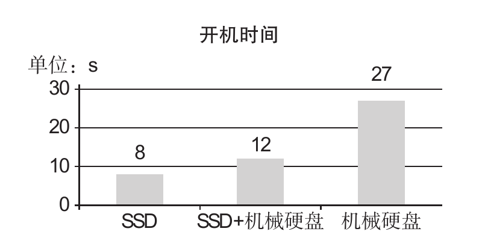

**图1-1 不同硬盘的开机时间对比（原书图1-1 · 局部截图）**

**SSD 的硬件组成**：主控（控制器）、闪存芯片、缓存 DRAM（可选，有的只有 SRAM）、PCB（电源芯片/电阻/电容等）、接口（SATA/SAS/PCIe）。从软件角度看，固件（Firmware）负责把接口端的数据调度到介质端，内嵌闪存寿命与可靠性管理算法。

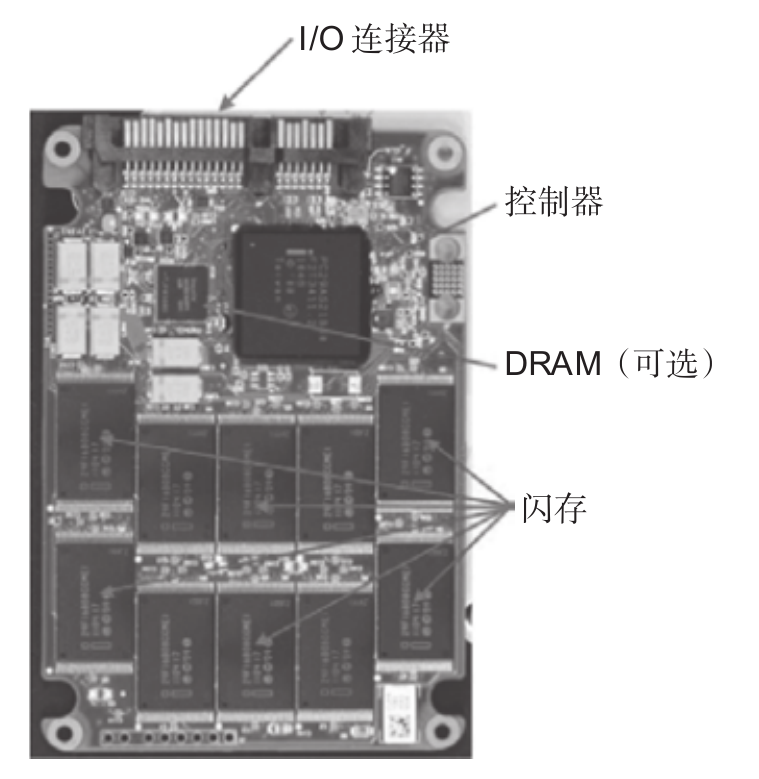

**图1-2 SSD 结构（原书图1-3 · 局部截图）**

外观上，除了沿用 HDD 的 2.5in/3.5in 外形，SSD 还有更小的 M.2、BGA 等形态。

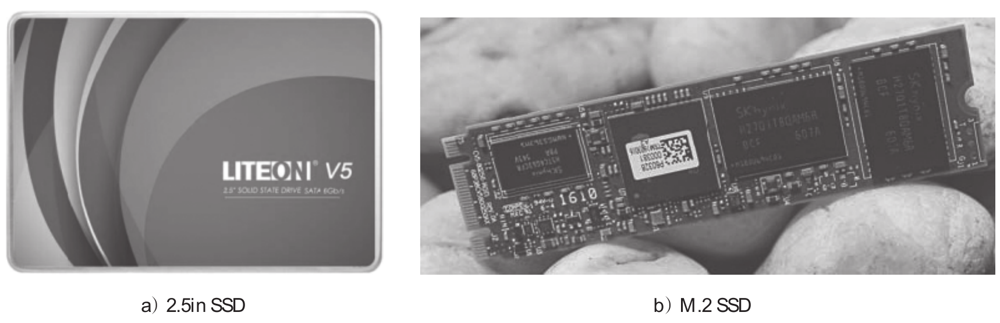

**图1-3 SSD 外观（原书图1-2 · 局部截图）**

**存储介质三分法**：光学介质（DVD/CD）、磁性介质（磁带/软盘/HDD）、半导体介质。半导体介质又分易失性（SRAM/DRAM）与非易失性；非易失性中又以 **NAND 闪存**为主流，另有 NOR、EEPROM 及 PCM（3D XPoint）、MRAM、RRAM、FRAM 等新型介质。

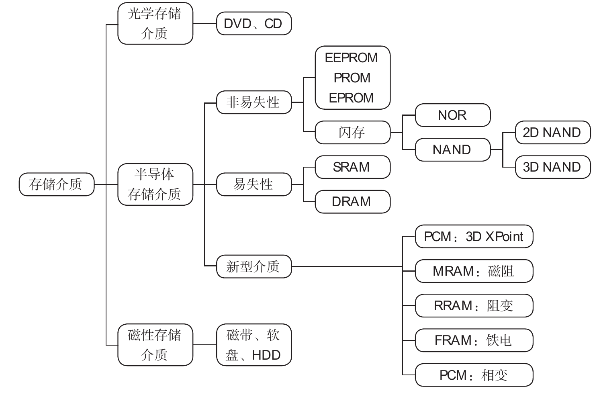

**图1-4 存储介质分类（原书图1-4 · 局部截图）**

当前闪存主要供应商：三星、SK 海力士、铠侠（Kioxia）、西数（WD）、长江存储（YMTC）。

---

## 1.2 SSD 与 HDD：结构、性能与功耗对比

### 结构对比

HDD 是“磁头+马达+磁盘”的机械结构，靠磁头寻道读写；SSD 是“闪存介质+控制器”的电子结构，直接用电信号读写。

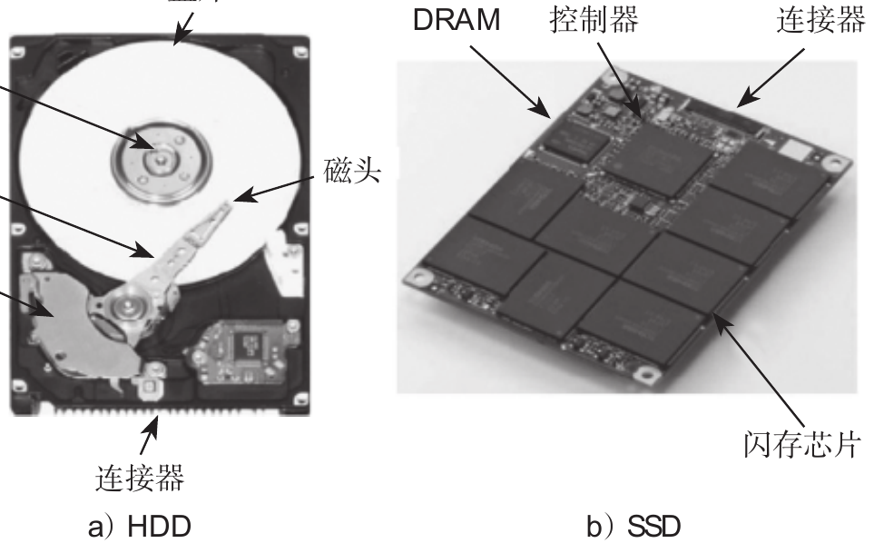

**图1-5 HDD 与 SSD 的物理结构（原书图1-5 · 局部截图）**

### 性能对比（以 500GB 的 SATA SSD 与 7200rpm HDD 为例）

| 指标 | SATA SSD | SATA HDD | 差异 |
| --- | --- | --- | --- |
| 连续读/写 | 540/330 MB/s | 160/60 MB/s | 3～6 倍 |
| 4KB 随机读/写 | 98 000/70 000 IOPS | 450/400 IOPS | 约 200 倍 |
| 数据访问时间 | 0.1 ms | 10～12 ms | 100～120 倍 |
| PCMark 性能得分 | 78 700 | 5 600 | 约 14 倍 |

随机读写（IOPS 和时延）是 SSD 与 HDD 差距最大的环节。

### SSD 的主要优点

- **功耗低**：HDD 工作功耗 6～8W，SATA SSD 约 5W；深度睡眠（DevSleep）可低于 10mW。
- **抗震防摔**：没有机械部件，跌落不存在磁头/盘片物理损伤。
- **无噪声**：无马达高速运转。
- **形态灵活**：除 2.5in/3.5in 外，还有 M.2，甚至可以做成 BGA 芯片级大小。

书中综合对比表（表 1-4）的结论是：随价格不断下降，SSD 取代 HDD 已成为现实。

---

## 1.3 固态存储及 SSD 技术发展史

### 里程碑（按书中叙述梳理）

| 时间 | 事件 | 意义 |
| --- | --- | --- |
| 1967 | 贝尔实验室姜大元、施敏发明浮栅晶体管 | 闪存的技术源头 |
| 1976 | Dataram 推出 Bulk Core（2MB，RAM 做存储） | 最早的 SSD，极其昂贵 |
| 1988 | 巨磁阻效应（GMR）发现 | 让 HDD 容量大爆发、统治存储市场 |
| 1991 | SanDisk 推出 20MB 闪存 SSD | 闪存 SSD 起步 |
| 1997–1999 | Altec、BiTMICRO 等推出闪存 SSD | 闪存 SSD 逐渐取代 RAM SSD |
| 2005–2006 | 三星等巨头进入 SSD 市场；笔记本开始用 SSD | 产业巨头入场 |
| 2007 | Mtron、忆正 SSD 追平企业级 HDD 性能 | “革命之年” |
| 2008–2009 | SSD 厂商上百家；1TB MLC SSD 出现 | 容量追平 HDD |
| 2010–2014 | 市场繁荣、并购整合（SandForce、Indilinx、Fusion-IO 等） | 控制器格局洗牌 |
| 2015 | 英特尔发布 3D XPoint；WD 以 190 亿美元收购闪迪 | 新型存储介质、产业整合 |
| 2017 | 英特尔推出 Optane（3D XPoint）SSD；96 层 3D NAND 发布 | 3D 堆叠进入 90+ 层时代 |
| 2018 | QLC 开始用于企业级 SSD；三星 Z-SSD | 每 Cell 更多 bit |
| 2019 | 长江存储推出 32 层 Xtacking 闪存样品 | 中国有自己的闪存原厂 |
| 2020 | 铠侠首款 PCIe 4.0 x4 企业级 NVMe SSD；NVMe ZNS 1.0 | 协议/接口换代 |
| 2021 | 英特尔 NAND/SSD 业务卖给 SK 海力士（新公司 Solidigm） | 原厂格局变化 |
| 2022 | PCIe 6.0 规范；SK 海力士 238 层 3D NAND | 3D NAND 进入 200+ 层 |

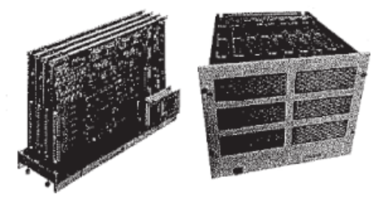

**图1-6 最早的 RAM SSD：Bulk Core（原书图1-7 · 局部截图）**

闪存的基础是浮栅晶体管：相比普通 MOSFET，中间多了一个被高阻抗材料包裹、可保存电荷的浮栅极，电荷通过量子隧道效应进出浮栅。

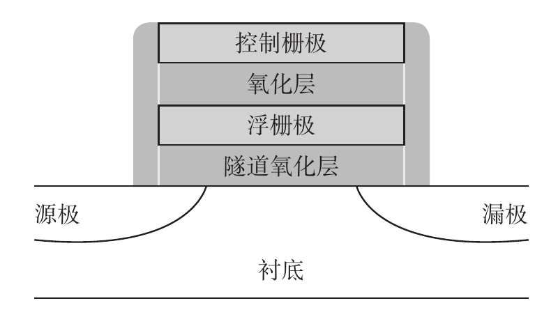

**图1-7 浮栅晶体管结构（原书图1-9 · 局部截图）**

---

## 1.4 SSD 基本工作原理

### SSD 的三大功能模块

SSD 从主机收到的“输入”是命令（Command），输出是数据（Data）和命令状态。内部由三大模块组成：

1. **前端**：接口与协议模块，直接和主机通信；
2. **FTL（Flash Translation Layer，闪存转换层）**：做地址转换、坏块管理、垃圾回收、磨损均衡等；
3. **后端**：和 NAND 闪存通信的模块。

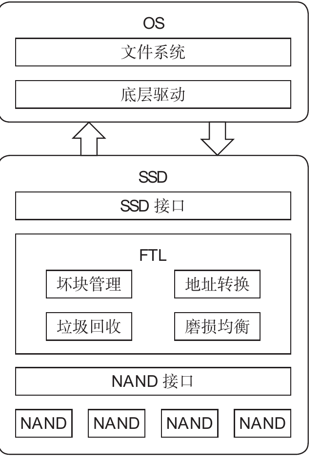

**图1-8 SSD 系统调用（原书图1-13 · 局部截图）**

对应接口协议：SATA 用 ATA 命令 + AHCI；SAS 用 SCSI 命令集；PCIe 用 NVMe 命令集。

### 读写流程与“映射表”

以写为例：主机发写命令 → SSD 收数据缓存到内部 RAM → **FTL 为逻辑块分配一个闪存物理地址** → 达到一定量后交给后端写入闪存。

因为闪存**不能覆盖写**，写入位置不能固定，所以 SSD 必须维护一张“逻辑地址→物理地址”的映射表。以 128GB 盘、4KB 逻辑块为例：共有 32M 个逻辑块，每个地址 4B，映射表约需 **128MB**。

### FTL 还要做很多事

- **垃圾回收（GC）**：闪存有大量无效数据页，把某几个块的有效页搬出、集中写入空闲块，再整块擦除，腾出可用空间。
- **磨损均衡**：让每个闪存块尽量均衡地被擦写，保证总可写量最大。
- 坏块管理、读干扰处理、数据保持处理、错误处理等。

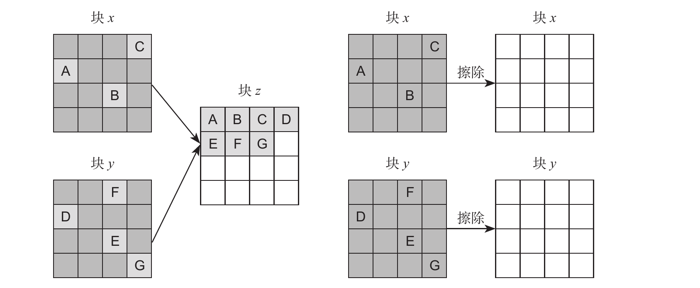

**图1-9 垃圾回收示意图（原书图1-14 · 局部截图）**

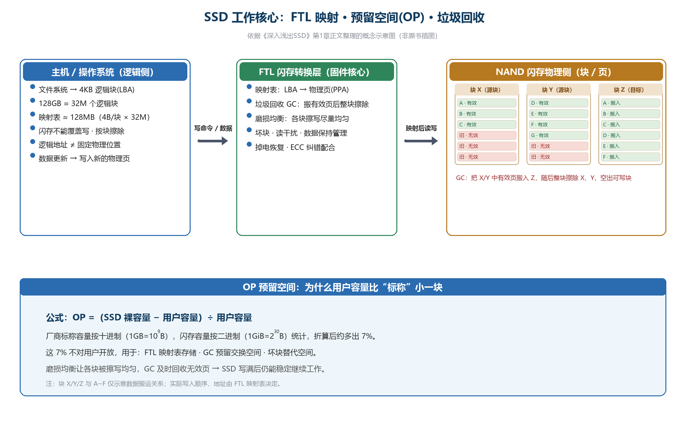

**图1-10 示意图：FTL 映射 + OP 预留空间 + GC（概念示意图，非原书插图）**

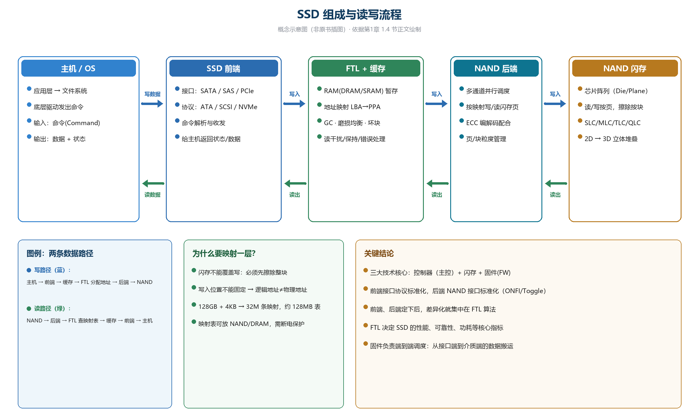

**图1-11 SSD 组成与读写流程（概念示意图，非原书插图）**

---

## 1.5 SSD 产品核心指标

书中以英特尔企业级 SATA 数据中心盘 **S3710** 的规格书为样本，把指标分成六类：基本信息、性能、寿命、数据可靠性、功耗、系统兼容性。

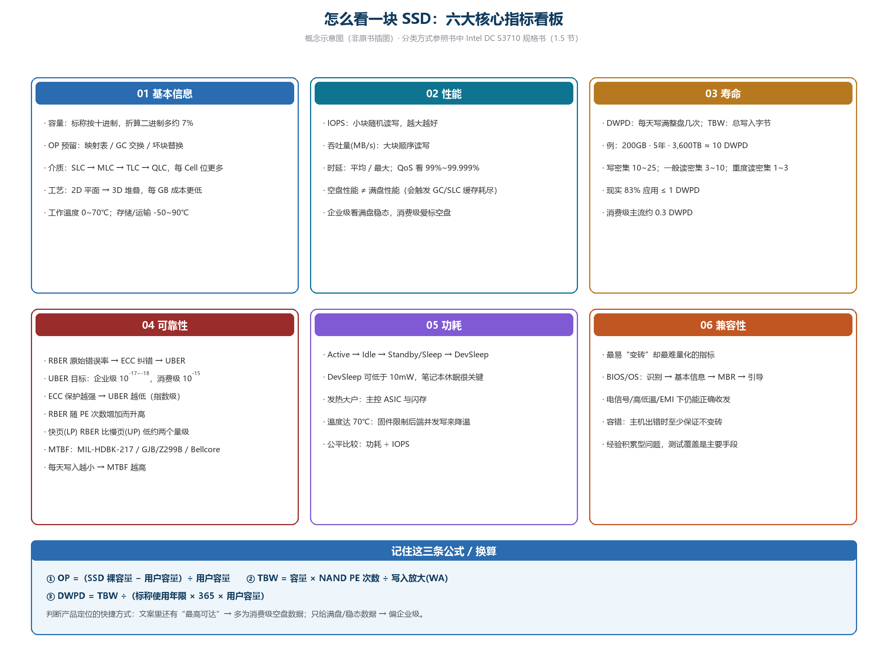

**图1-12 怎么看一块 SSD：六大核心指标看板（概念示意图，非原书插图）**

### 1.5.1 基本信息剖析

**容量与 OP（预留空间）**

- 厂商标称容量按**十进制**（1GB=10⁹B）计；按**二进制**（1GiB=2³⁰B）折算会多约 **7%**。
- 多出来的空间不能给用户用，而是用于 FTL 映射表、GC 预留交换空间、闪存坏块替代空间等，这就是 OP：

> OP =（SSD 裸容量 − 用户容量）÷ 用户容量

**介质：SLC / MLC / TLC / QLC**

| 类型 | 每 Cell 位数 | 擦除次数 | 读取 | 编程 | 擦除 |
| --- | --- | --- | --- | --- | --- |
| SLC | 1 | 100k | 30 μs | 300 μs | 1 500 μs |
| MLC | 2 | 3k | 50 μs | 600 μs | 3 000 μs |
| TLC | 3 | 1k | 75 μs | 1 000 μs | 4 500 μs |

从 2D 平面到 3D 立体堆叠，目的只有一个：让硅片单位面积产生更多 bit，降低每 GB 成本。

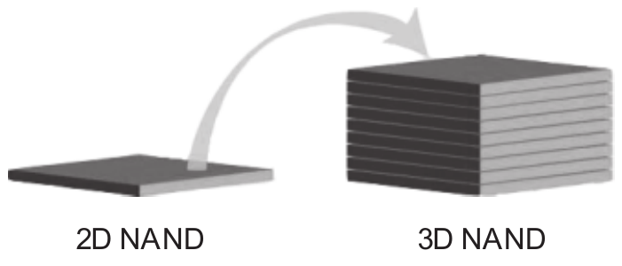

**图1-13 2D 与 3D 闪存结构示意（原书图1-16 · 局部截图）**

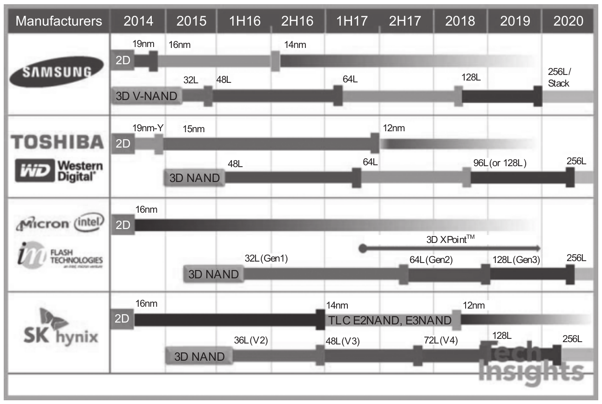

**图1-14 闪存原厂路线图（原书图1-17 · 局部截图）**

**外观尺寸（Form Factor）**：3.5in / 2.5in / 1.8in、mSATA、M.2、PCIe Add-In、U.2、EDSFF 等。

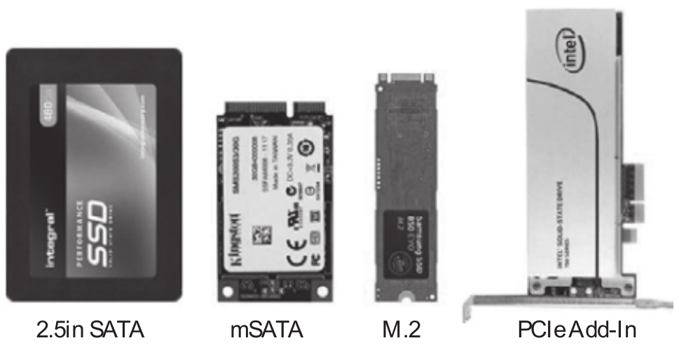

**图1-15 SSD 尺寸部分一览（原书图1-18 · 局部截图）**

**其他**：工作温度 0～70℃，非工作（存储/运输）-50～90℃；第三方标准组织认证与兼容性测试代表产品“达标”，可帮客户省去重复测试。

### 1.5.2 性能剖析

三大性能指标：

- **IOPS**：每秒 I/O 次数，对应小块（如 4KB）随机读写，越大越好；
- **吞吐量/带宽**：每秒传输的数据量，对应大块（如 512KB）顺序读写，越大越好；
- **响应时间/时延**：单条命令从发出到收到状态的时间，分平均时延与最大时延，越小越好。

访问模式由随机/顺序、块大小、读写比例三者组合而成，测试负荷都是这些模式的组合。

**QoS（服务质量）**：用“置信级”衡量最慢命令的时延，例如 99%～99.999% 命令都在某个时延以内。

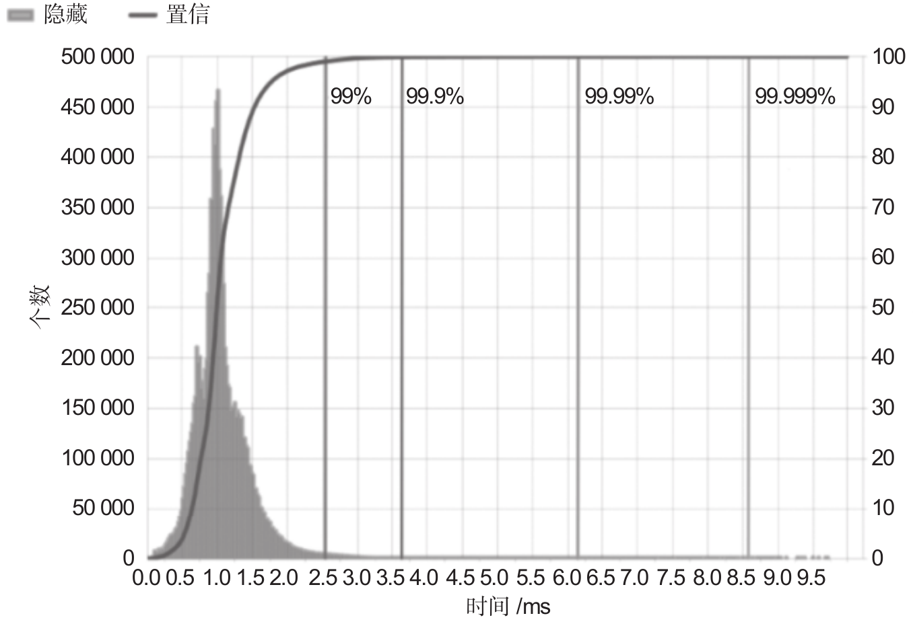

**图1-16 SSD 延时分布图（QoS）（原书图1-20 · 局部截图）**

**空盘 vs 满盘（重要考点）**：

- 消费级 SSD 宣传的一般是**空盘**性能，写满后会因 GC、SLC 缓存用完等原因“掉速”；
- 企业级客户更关注**满盘/稳态**性能，因此文案里常没有“最高可达”字样，可用这一点快速区分企业级与消费级。

### 1.5.3 寿命剖析

寿命指标有两个：

- **DWPD**：保质期内每天能把整盘写满多少次；
- **TBW**：生命周期内总共能写入的字节数。

换算示例（S3710）：200GB、5 年、3 600TB → 平均每天写入约 1 972GB ≈ **10 DWPD**。

不同应用对 DWPD 要求不同：写密集型（数据库/媒体编辑/虚拟化）10～25；一般读密集 3～10；重度读密集 1～3。现实数据统计里，**83% 的应用 DWPD 需求不超过 1**，主流消费级 SSD 约为 **0.3 DWPD**。

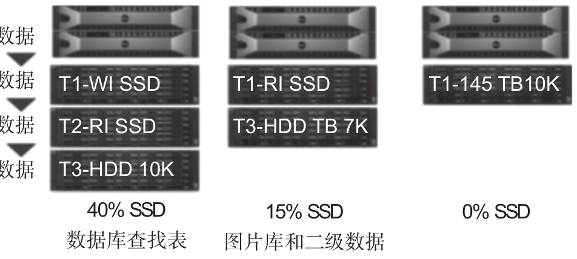

**图1-17 数据分层及 SSD 应用（原书图1-23 · 局部截图）**

> 常见分层思路：OLTP 热数据放 T1-WI（写密集 SSD）→ 温数据放 T2-RI（读密集 SSD）→ 冷数据放大容量 HDD。图中示例 OLTP 用 SSD 比例约 40%，数据仓库约 15%，容灾恢复为 0%。

**两个寿命公式**：

> TBW = 容量 × NAND PE Cycles ÷ 写入放大系数 WA
>
> DWPD = TBW ÷（使用年限 × 365 × 容量）

### 1.5.4 数据可靠性剖析

三个可靠性指标：

- **RBER（原始错误比特率）**：闪存出厂自带的原始位翻转率，反映闪存介质质量；
- **UBER（不可修复错误比特率）**：经过 ECC 等纠错后仍读错的概率，直接面向用户；
- **MTBF（平均故障间隔时间）**：反映产品硬件无故障运行能力。

错误主要来自：擦写磨损（P/E Cycle）、读干扰、编程干扰、数据保持错误。

关键结论（图 1-26/图 1-27 的原书数据）：

- 相同编码长度与 RBER 下，**ECC 保护强度越高，UBER 指数级下降**（示例中强度从 37 增到 43，UBER 从 10⁻¹³ 量级降到 10⁻¹⁷ 量级）；
- 相同保护强度下，**RBER 越低，UBER 越低**（示例 RBER 从 2.75e-3 降到 1.25e-3，UBER 下降 8.4 亿倍量级）。

典型 UBER 要求：企业级 10⁻¹⁷ 甚至 10⁻¹⁸；消费级 10⁻¹⁵。

MTBF 计算常用标准：MIL-HDBK-217（美国军标）、GJB/Z299B（国军标）、Bellcore（商用电子）；同一 SSD 负载越小 MTBF 越高（书中示例 20/10/5GB 每天，分别对应 120 万/250 万/400 万小时）。

### 1.5.5 功耗剖析

功耗状态（从高到低）：Active（活跃）→ Idle（空闲）→ Standby/Sleep（待机/睡眠）→ DevSleep（深度睡眠，约 10mW 以下）。主机是功耗模式发起端，SSD 被动执行。

| 链路状态 | 功耗 | 进入时间 | 退出时间 |
| --- | --- | --- | --- |
| Active（Ready） | >1 000 mW | 0 | 0 |
| Idle（Partial） | 100 mW | 10⁻⁶ s | 10⁻⁴ s |
| Idle（Slumber） | 50 mW | 10⁻³ s | 0.01 s |
| Idle（DEVSLP） | 5 mW | 0.02 s | 0.02 s |
| Off-RTD3 | 0 | 1.5 s | 0.5 s |

功耗与性能/温度是矛盾的：频繁进出低功耗会带来性能损失；满载工作时主控和闪存发热最大，固件通常在温度达到 **70℃** 阈值时限制闪存并发写来降温（性能相应下降），降温后再恢复并发，形成“温度—性能”的往复控制。

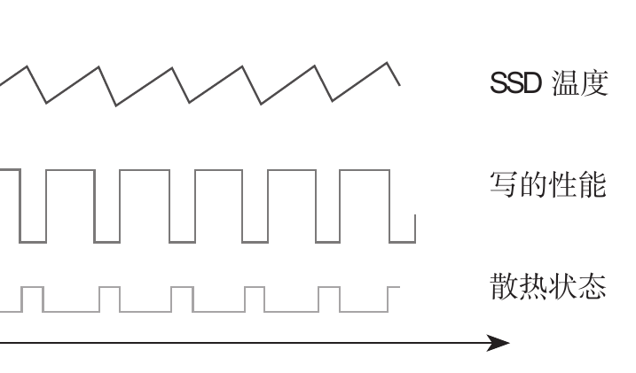

**图1-18 温度控制和 SSD 性能的关系（原书图1-32 · 局部截图）**

### 1.5.6 系统兼容性剖析

系统兼容性最难量化，却是 SSD“会不会变砖”的关键，分为三类：

1. **BIOS/OS 兼容性**：上电识别、读基本信息、读 SMART、找 MBR→DPT→PBR→加载 OS，任一步失败都会启动失败；
2. **电信号与硬件兼容性**：抖动、信号完整性差、高低温、电磁干扰下仍能正确收发数据；
3. **容错处理**：主机端出错时 SSD 至少不变砖，最好能返回错误状态并提供日志。

---

## 1.6 接口形态

SSD 是标准件，必须符合接口规范、尺寸和电气特性。

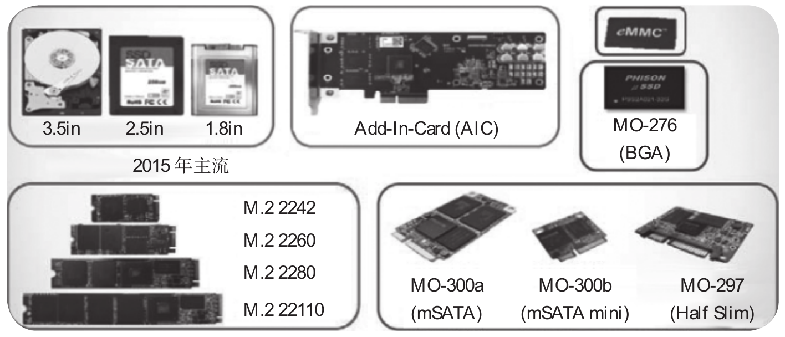

**图1-19 各种类型的 SSD 示意图（原书图1-33 · 局部截图）**

### 2.5in

企业级 SSD 的主流尺寸，支持 SATA、SAS、PCIe 三种接口；1U 存储/服务器机架可放 20～30 块。

### M.2

原名 NGFF，为超极本设计，替代 mSATA。命名规则为 Type（宽×长），如 Type 1620 表示 16mm 宽、20mm 长。主流的两个 Key：

- **B（Socket2）**：SATA / PCIe x2，带宽最高约 2GB/s，单面金手指；
- **M（Socket3）**：PCIe x4，带宽最高约 4GB/s，双面金手指；M 是消费级与未来的主流。

M.2 只规定引脚物理形态，上面跑 SATA 还是 PCIe，要看具体产品。

### BGA SSD（uSSD）

把整块 SSD 放进 16mm×20mm 的 BGA 封装（对应 M.2 Type 1620），比传统 M.2 SSD（22mm×60mm）空间占用小很多，可节省 15% 以上平台空间、增加约 10% 电池寿命、降低 SSD 自身高度。2016 年三星 PM971 拉开了消费级 BGA SSD 普及的序幕。

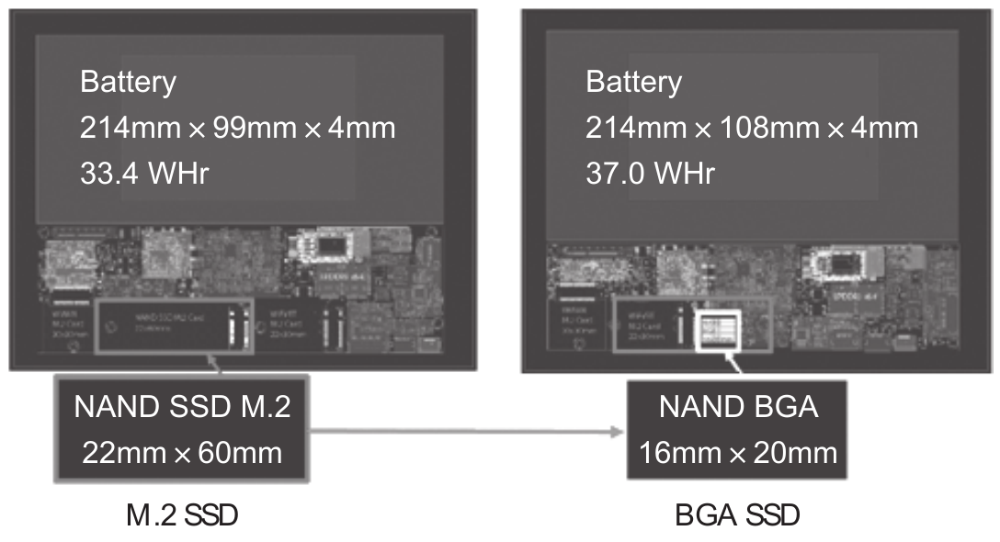

**图1-20 传统 M.2 SSD 与 BGA SSD 空间占用对比（原书图1-36 · 局部截图）**

### U.2

即 SFF-8639，是 PCIe SSD 的 2.5in 盘形态，统一了 SATA、SAS、PCIe 三种物理接口，已成为企业级 SSD 的主要形态。

### EDSFF（E1 / E3）

为数据中心 1U/2U 服务器优化，降低 TCO：

- **E1.S**：细长型，5.9～25mm 厚度，适合中等容量与灵活配置；
- **E1.L**：长 318.75mm，俗称 Ruler，适合大容量（如 QLC），能塞下 PB 级容量；
- **E3.S / E3.L**：更接近 U.2 的部署习惯，为 PCIe 4.0→5.0 时代准备，支持 4/8/16 通道，E3.L 2T 可达 70W。

部署密度对比：1U 前面板从 10 块 U.2/U.3 提升到 32 块 E1（9.5mm）；同样空间里 U.2 放 24 块时，E3 可放 46 块。

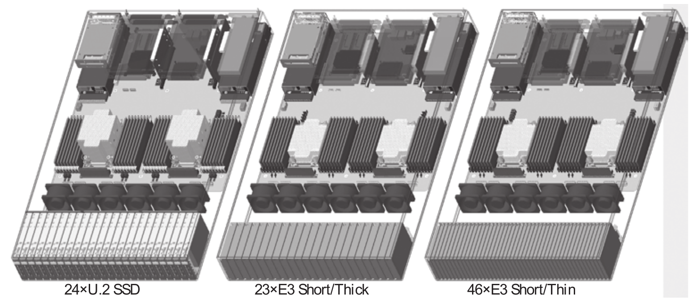

**图1-21 E3 SSD 实际服务器部署图（原书图1-39 · 局部截图）**

---

## 小结：一张图记住第一章

- **介质**：NAND 闪存（SLC/MLC/TLC/QLC，2D→3D 堆叠）；
- **组成**：主控 + 闪存 + 固件（前端协议 / FTL / 后端 NAND 接口）；
- **本质**：FTL 把“不能覆盖写的闪存”包装成“可覆盖写的硬盘”，再通过 GC、磨损均衡、坏块管理等保证容量、性能与寿命；
- **看产品看六件事**：基本信息（容量/OP/介质/温度）、性能（IOPS/吞吐/时延/QoS）、寿命（DWPD/TBW）、可靠性（RBER/UBER/MTBF）、功耗（状态机与温控）、系统兼容性；
- **形态跟着接口走**：2.5in、M.2、BGA、U.2 是当下主流；EDSFF（E1/E3）面向未来高密度服务器。
