# 第 4 章 SSD 主控 · 重点总结

> 依据《深入浅出SSD：固态存储核心技术、原理与实战（第 2 版）》第 4 章原文整理。插图均为从原书 PDF 裁切的局部图（非整页截图、不含原书图注）；标“概念示意图”者为辅助理解绘制的示意图，非书中原图。

---

## 0. 本章主线

SSD 主控本质是一颗 **SoC（片上系统）**：对外收主机命令、对内管 NAND 闪存颗粒。本章从两条线展开：

1. **4.1 控制器架构**：主控里到底有哪些模块、数据怎么流动；
2. **4.2 主控厂商**：国际与国内有哪些玩家、各自的代表产品与打法。

---

## 4.1 解读控制器架构

### 主控的整体模块划分

SSD 控制器作为片上系统，主要模块如下：

- **前端主机接口模块**：PCIe 控制器 + NVMe 协议控制器；
- **后端闪存接口模块**：直接和 NAND 交互的通道，一条通道可挂多颗闪存；
- **后端数据处理模块（数据处理单元）**：RAID、扰码器、LDPC 等；
- **DDR 控制器和 PHY**：负责与外部 DRAM 交互；
- **安全模块**：加解密与认证；
- **CPU 及互连系统**：指挥整个系统、协调各硬件模块；
- **其他**：片上 SRAM、模拟 IP、外设端口等。

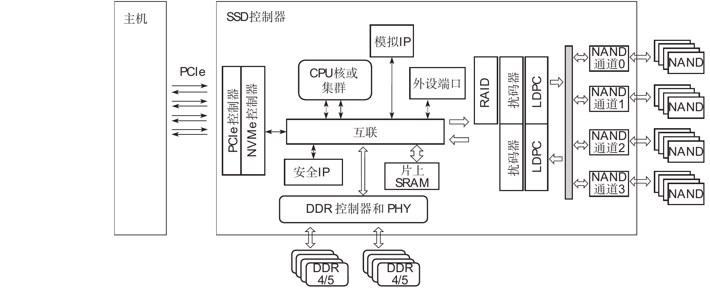

**图4-1 SSD 控制器框架图（原书图4-1 · 局部截图）**

### 前端子系统：PCIe + NVMe

- PCIe 决定主机接口带宽：主流消费级控制器约 4 通道，企业级常为 8 通道或更多；
- **PCIe PHY 是核心 IP**，主要供应商为 Synopsys、Cadence、Rambus；
- NVMe 交互采用“**提交队列 SQ → Doorbell 通知 → 控制器取命令 → CPU/固件执行 → 更新完成队列 CQ → 中断（MSI-X）通知主机**”的机制；
- NVMe 控制器内部有 **控制通道与数据通道两条通道**，数据最终经 DMA 送到内存系统。

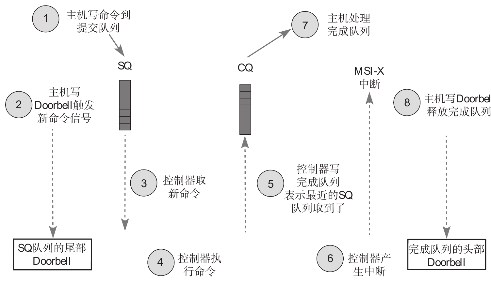

**图4-2 NVMe 控制器与主机间交互流程示意图（原书图4-2 · 局部截图）**

### 后端子系统：任务调度 + 数据处理 + 闪存驱动

- **任务调度器（Task Scheduler）**是后端大脑，通过 SQ/CQ 与固件交互，把命令拆成“数据处理单元”和“闪存驱动”可执行的操作；
- **NAND 写方向数据处理**：固件元数据 + 用户数据合并 → RAID 异或运算 → 扰码器伪随机化 → LDPC 编码并生成校验；
- **NAND 读方向数据处理**：LDPC 译码 → 去随机化 → 判断并去掉固件元数据；
- 闪存驱动内含微码处理器与闪存 PHY，负责把数据写到具体 NAND 颗粒。

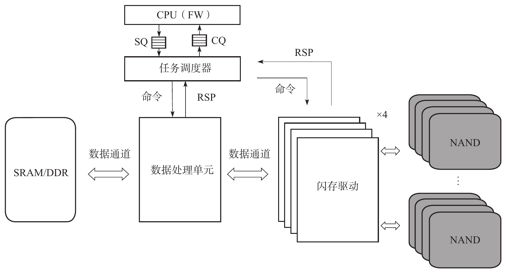

**图4-3 后端子系统框架图（原书图4-4 · 局部截图）**

### 内存子系统：片上 SRAM + 外接 DRAM

- 片上 **SRAM 资源有限**，按 AU（Allocation Unit，约 4KB）组织申请与释放；可由固件管理，也可固件+硬件配合管理；
- 外接 **DRAM 主要放 L2P 映射表和用户写数据**，经 DRAM 控制器访问，容量大但速度比片上 SRAM 慢；
- 消费级为降成本可采用 **DRAM-less** 方案（省掉 DRAM 控制器与 PHY）。

### 安全子系统：验签与数据加解密

- **固件验签/授权**：SHA-256、SM3（哈希），RSA、SM2（公钥验签），AES、SM4（系统文件加解密），TRNG（真随机数）；
- **用户数据加解密**：国际 AES-XTS-256/128，国内 SM4-XTS-128；
- **TCG Opal 自加密盘（SED）**：明文经硬件 AES 引擎加密后写盘；媒体加密密钥 MEK 被 KEK 加密保存，KEK 由用户验证密钥经 KDF 运算产生，形成“加密—认证”闭环。

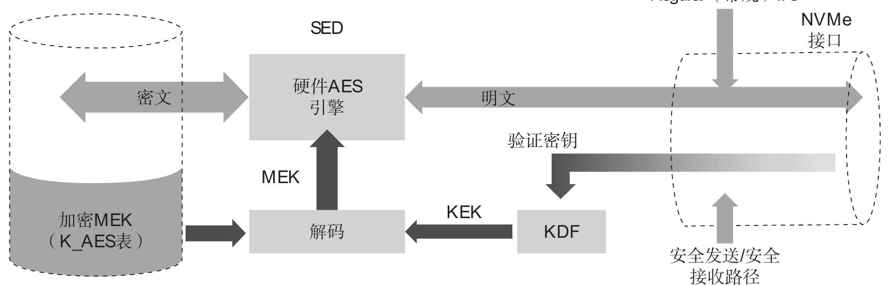

**图4-4 自加密盘数据处理示意图（原书图4-5 · 局部截图）**

### CPU 计算子系统

- 主流实时核为 **ARM R 系列（R5/R8）**，也可见 Synopsys ARC、RISC-V 核；
- 高端企业级控制器常用 **ARM A 系列（A53/A55）**作主处理器；
- 重要部件包括 **ITCM（存指令）/ DTCM（存关键数据）**；多核 CPU 可通过共享 TCM 高效通信。

### 企业级与消费级控制器差异

| 维度 | 消费级 | 企业级 |
| --- | --- | --- |
| 企业特性 | 较少 | 双端口、SR-IOV、PI、CMB、WRR、在线固件升级等 |
| 性能 | 看瞬时峰值、成本优先 | 看满盘/稳态性能、时延一致性、QoS |
| 功耗 | 重视待机与低功耗（PS3/PS4） | 大多时间忙碌，只需满足最大功耗上限 |

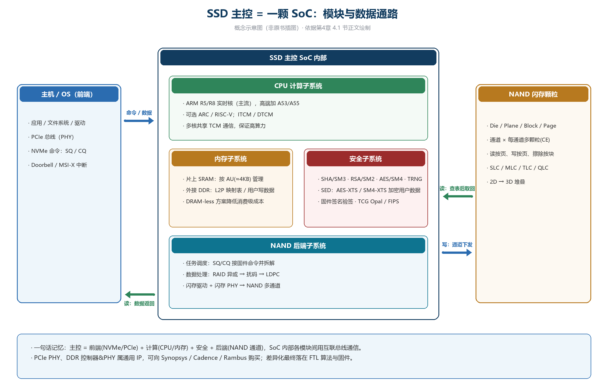

**图4-5 SSD 主控 = 一颗 SoC：模块与数据通路（概念示意图，非原书插图）**

---

## 4.2 SSD 主控厂商

### 市场格局

SSD 主控大体分两类：**消费级 cSSD 主控**与**企业级 eSSD 主控**。

- 第三方独立主控市场：消费级由 **慧荣（SMI）+ 群联（Phison）合计占 80% 以上**；企业级由 **Marvell（迈威迩/美满）与 Microchip（微芯）** 领头；
- 国内消费级新势力：联芸、英韧、得一微、特纳飞；国内企业级新势力：英韧、得瑞领新、大普微、芯盛智能；
- 另有 **NAND 原厂自研主控 + 自研固件**路线，直接供应联想、惠普、戴尔等 PC OEM。

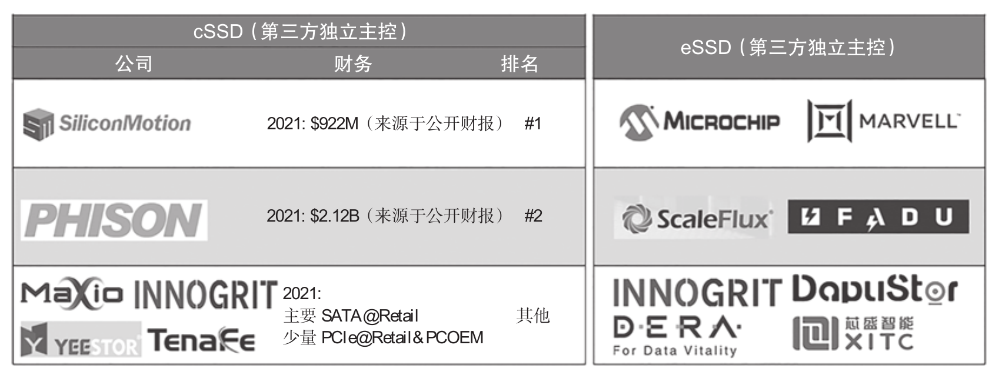

**图4-6 第三方独立 SSD 主控厂商（非原厂）（原书图4-6 · 局部截图）**

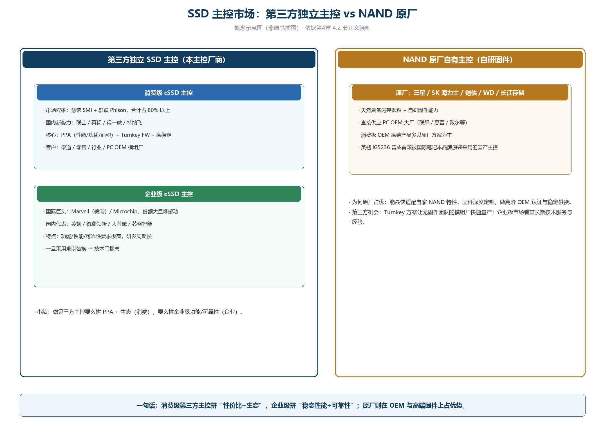

**图4-7 SSD 主控市场：第三方独立主控 vs NAND 原厂（概念示意图，非原书插图）**

消费级主控核心竞争点：**芯片 PPA（性能/功耗/面积）**、快速适配各类 NAND 的 **Turnkey FW**、高稳定性；最高要求是进入 PC OEM。

企业级主控核心竞争点：**RAS（可靠性/可用性/可服务性）**、稳态性能、时延 QoS、更强的 ECC、RAID 多 Die 保护、全路径端到端数据保护、严格的 Data Retention / DWPD 要求。企业级 UBER 要求通常比消费级低 1～2 个数量级（如 10⁻¹⁷）。

### 4.2.1 SSD 主控国际大厂

#### 1. Marvell（迈威迩 / 美满）

2021 年 5 月发布**全球首款 PCIe 5.0 SSD 主控 Bravera SC5**，首次支持 16 条 NAND 通道，并可在不改硬件的情况下支持 SEF、ZNS、Open Channel。

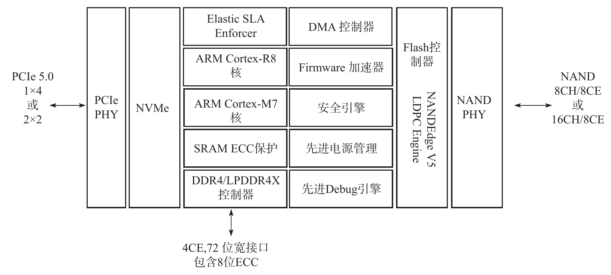

**图4-8 Bravera SC5 主控架构简图（原书图4-7 · 局部截图）**

| 参数 | MV-SS1331 | MV-SS1333 |
| --- | --- | --- |
| 主机接口 | PCIe 5.0 x4（双端口 ×2） | 同左 |
| NAND 接口 | 8CH @1600MT/s | 16CH @1600MT/s |
| DRAM 缓存 | DDR4-3200 / LPDDR4x-4266（带 ECC） | 同左 |
| 连续读/写 | 14 GB/s / 9 GB/s | 同左 |
| 4K 随机读/写 | 1.8M / 1M IOPS | 同左 |
| 功耗 | 9W | 9.8W |
| 虚拟化 | 16 物理功能 / 32 虚拟功能 | 同左 |

采用第五代 NANDEdge LDPC，支持各家 SLC~QLC 3D NAND；与前代 PCIe 4.0 相比性能翻倍，能耗比提升约 40%，封装 20mm×20mm。

#### 2. Microchip（微芯）

Flashtec 系列基于 **NoC（片上网络）+ 众核 CPU** 架构，支持 SMP 与浮点运算，可运行操作系统，因此既当 SSD 主控，也能做 CSD（计算型存储控制器）。PCIe 3.0 时代即率先把企业级随机 I/O 冲破 **1M IOPS**。

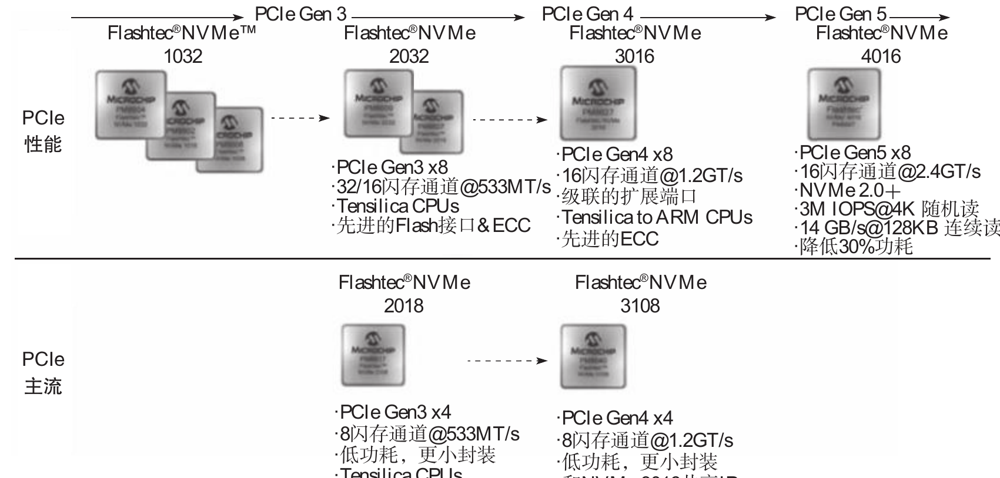

**图4-9 Flashtec 主控发展历程（截至 2022 年 6 月）（原书图4-8 · 局部截图）**

最新 **Flashtec 4016 PCIe Gen5**（计划 2023 年量产）：

- 16 个可编程 NAND 通道 @ 最高 2400MT/s，支持 ×8、双×4、×4、双×2 等端口；
- 连续读最高 14GB/s，4K 随机读 3M IOPS；支持 200TB 大容量 SSD 设计；
- 高级 QoS、LDPC/ECC、链路加密、双重签名认证、设备虚拟化；
- 内置可编程 **ML 机器学习引擎**，用于模式识别与智能 NAND 管理；
- 支持 NVMe 2.0+（含 ZNS）；灵活可定制固件；功耗比上代降 30%，25mm×25mm 封装。

### 4.2.2 SSD 主控国内厂商

#### 1. 英韧科技（InnoGrit）

从 PCIe 3.0 起跑，2020 年成为**全球最早量产 PCIe 4.0 主控**的厂商之一，2022 年推出 PCIe 5.0 主控。

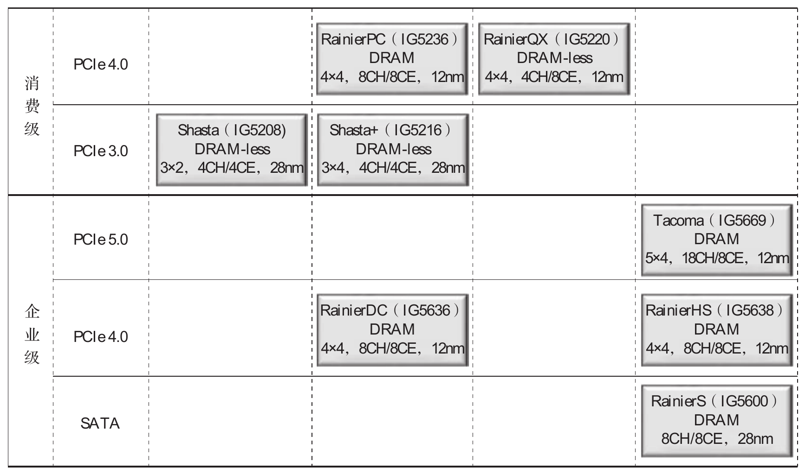

**图4-10 英韧科技主控发展路线（原书图4-11 · 局部截图）**

| 定位 | 型号 | 关键规格 |
| --- | --- | --- |
| 消费级 | RainierPC IG5236 | PCIe 4.0 x4，8CH/8CE，12nm；顺序 7.4/6.4 GB/s |
| 消费级 | RainierQX IG5220 | PCIe 4.0 x4 DRAM-less，4CH/8CE；>7/>6 GB/s，首颗支持 2400MT/s |
| 消费级 | Shasta+ IG5216 / Shasta IG5208 | PCIe 3.0 x4/x2 DRAM-less，28nm |
| 企业级 | RainierDC IG5636 | PCIe 4.0 x4，8CH/8CE，12nm，2020 量产 |
| 企业级 | RainierHS IG5638 | PCIe 4.0 x4 DRAM，8CH/8CE，12nm |
| 企业级 | RainierS IG5600 | SATA 主控，8CH/8CE，28nm |
| 企业级 | Tacoma IG5669 | PCIe 5.0 x4，16/18CH/8CE，12nm；顺序 14/11 GB/s，支持 32TB |

英韧技术要点：

- RainierDC 用自研 **4K LDPC**，配合 suspend/resume 技术优化 QoS：写带宽 1500MB/s 时，随机读时延 99.9% < 360μs；
- Tacoma（IG5669）：支持 NVMe 2.0、ONFI 5.0、Toggle 5、SCM（MRAM/XL-FLASH）、ZNS；
- Tacoma 用 **MRAM 做断电保护**，可省去超级电容；提供**高优先级写命令队列**承载日志数据（可替代把日志写 Optane 的做法）；
- 混合自适应 ECC 可同时支持多种码字与码率，端到端 4K 随机读整体系统时延可低至约 10μs。

#### 2. 得瑞领新（DERA）

2015 年成立于北京，专注企业级 NVMe 控制器与 SSD，6 年量产 3 代主控、11 款 SSD 模组。

- **MENG**：PCIe Gen3 x4 企业级/数据中心主控，16 通道，多核 CPU，双 DDR 接口；
- **EMEI**：首款支持 PCIe 4.0 的企业级主控，12nm 工艺，自研 4K LDPC；
- SSD 产品 D7436/D7456：LDPC 硬件纠错 + 动态 RAID + 掉电保护 + 端到端保护，稳态随机写最高 430k IOPS，随机读/写时延 70/10μs。

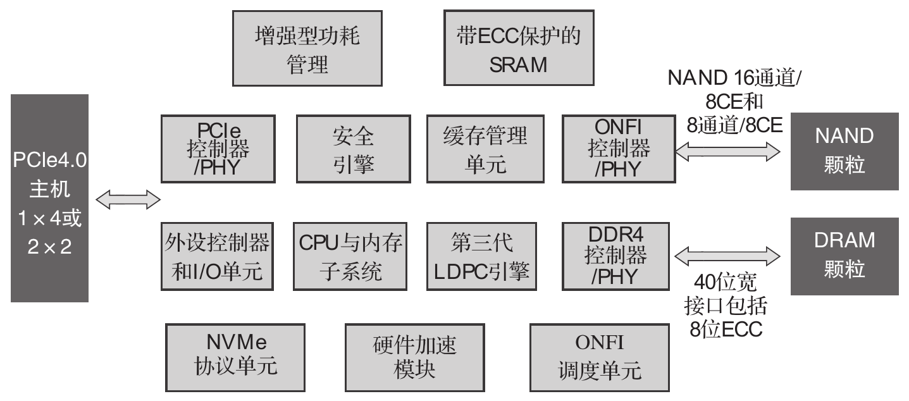

**图4-11 得瑞 EMEI 控制器（原书图4-15 · 局部截图）**

| EMEI 关键性能 | 数值 |
| --- | --- |
| 制程 / 接口 | 12nm；PCIe 4.0 x4 双端口；NVMe 2.0 |
| 容量 | 512GB ~ 32TB 原始容量 |
| 顺序读/写 | 7400 / 7000 MB/s |
| 随机读/写 | 1700k / 430k IOPS |
| 随机读/写时延 | 65 / 8 μs |
| 纠错与安全 | 自研 4K LDPC；AES 硬件 + SM2/SM3/SM4 + TRNG；支持 ZNS |

#### 3. 大普微（DapuStor）

DPU600（DPU616）为高端 PCIe 4.0 企业级主控（12nm FinFET）：

| DPU600 参数 | 数值 |
| --- | --- |
| 接口 / 协议 | PCIe 4.0 双端口；NVMe 1.4a / NVMe MI 1.1 |
| 容量 | 单主控 32TB TLC / 64TB QLC；双主控级联 64TB / 128TB |
| 顺序读/写 | 15 / 10 GB/s |
| 随机读/写（稳态） | 2.6M / 0.9M IOPS |
| 随机写时延 | 5 μs |
| 可靠性 | 基于 3D TLC/QLC 满足 UBER 10⁻¹⁷；4KB LDPC、硬件 RAID5、全通路保护 |
| 安全 | TCG / AES / RSA / SHA / TRNG；SM2/SM3/SM4；安全启动 |

大普微早在 2016 年提出 **PIS（存储中处理）** 理念并落到 DPU600：主控内置可运行 Linux 的应用 CPU、片上硬件加速（搜索/加密/RAID/LSTM 等）与可选 FPGA，支持把 SSD 内加解密硬件虚拟化后开放给主机软件。

#### 4. 芯盛智能（XITC）

2022 年发布**全球首款基于 RISC-V 架构的 12nm PCIe 4.0 + SATA 3.0 双模高端主控——行者（Walker）**，采用 RISC-V 开源 6 核架构。

| 行者型号 | XT8210 | XT6130 |
| --- | --- | --- |
| 主机接口 | PCIe 4.0 x4 | SATA 3.0 |
| NAND 接口 | 8CH + 4CE | 同左 |
| 容量 | 16TB | 8TB |
| 顺序读/写 | 7500 / 6500 MB/s | 560 / 520 MB/s |
| 随机读/写 | 1000k / 900k IOPS | 100k / 90k IOPS |
| 安全 | 国密二级、国测 EAL4+；SM2/SM3/SM4 | 同左 |

SSD 产品线：企业级 SATA **SS3000**、企业级 PCIe 4.0 **SP3000**（7400/6500 MB/s、1000k/640k IOPS）、工业宽温 **DS3000**（-40~+85℃）、安全加密盘 **MP250M**、嵌入式 **E110**，实现从 IC 设计到成品全流程国产化。

#### 5. 慧荣科技（Silicon Motion，SMI）

- 拥有 20 年以上主控设计经验，兼容性居业界前列，支持铠侠、三星、SK 海力士、Solidigm、西数、长存等各家闪存；
- 提供主控芯片 + 固件平台的完整 **Turnkey** 方案；
- 近期被 **MaxLinear 收购**，交易隐含价值约 38 亿美元。

#### 6. 群联电子（Phison）

- 从全球首颗单芯片 USB 闪存盘控制器起家，现覆盖 USB、SD、eMMC、UFS、SATA、PCIe SSD 等；
- 每年销售超 **6 亿颗**控制器，2021 年营收超 22 亿美元，员工超 2600 人；
- **ONFI 创始会员**之一，SD / UFS 协会董事。

#### 7. 联芸科技（Maxio）

2014 年成立于杭州，已发展为**全球三大 SSD 控制器及解决方案提供商之一**，掌握闪存自适配技术，可兼容主流原厂全部 NAND 颗粒；产品覆盖消费级、企业级、工业级，并延伸 UFS/eMMC。

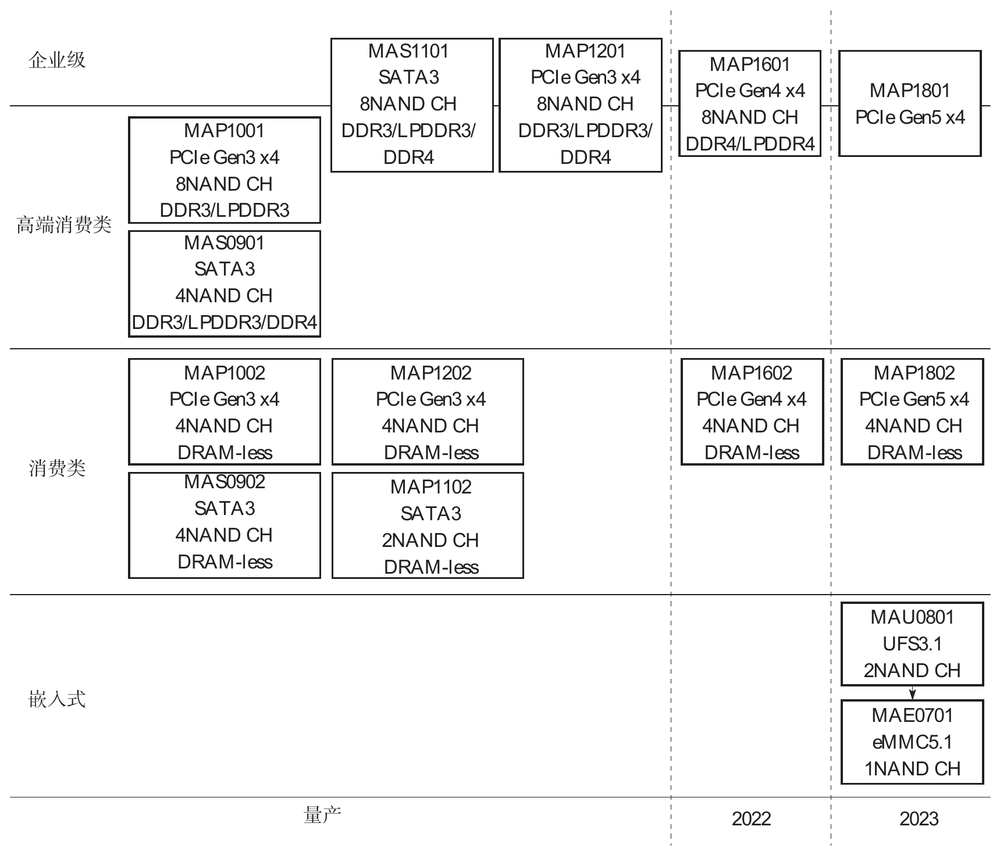

**图4-12 联芸控制器产品图谱（原书图4-26 · 局部截图）**

图谱要点：

- **企业级**：MAS1101（SATA3，8CH）、MAP1201/MAP1601/MAP1801（PCIe Gen3/4/5 x4，8CH，带 DRAM）；
- **高端消费类**：MAP1001/MAP1002（PCIe Gen3）、MAP1202（PCIe Gen3）、MAP1602（PCIe Gen4）、MAP1802（PCIe Gen5），4CH；带 DRAM 或 DRAM-less；
- **消费类**：MAS0902（SATA3）、MAP1102（SATA3）DRAM-less；
- **嵌入式**：MAU0801（UFS 3.1）、MAE0701（eMMC 5.1）。

#### 8. 特纳飞（TenaFe）

2019 年成立于北京，面向 PC OEM 与数据中心。

| 参数 | TC2200 | TC2201 |
| --- | --- | --- |
| 状态 | 量产（2021 年底） | 样品 Q4’2022 |
| 接口 | PCIe 4.0 x4，NVMe 1.4 | 同左 |
| 闪存 | 4 通道 @1600MT/s | 4 通道 @2400MT/s |
| 缓存 | DRAM-less | DRAM-less |
| 连续读 | 5 GB/s | 7.4 GB/s |
| 随机读 | 550k IOPS | 1M IOPS |
| 功耗 | <1.5mW（PS4） | 同左 |
| 数据完整性 | 4KB LDPC、Plane&Die RAID、SRAM SECDED、端到端保护 | 同左 |
| 封装 | 12mm×12mm | 7.5mm×12mm |

规划中的 PCIe 5.0 控制器：连续读 14GB/s、随机读 2.5M IOPS、后端 8 通道、支持 3600MT/s NAND，面向企业级数据中心与高端消费。

#### 9. 得一微（YEESTOR）

- 2007 年成立于深圳，提供存储控制器、工业存储模组、IP 与设计服务；
- 累计出货超 **10 亿套**，已授权发明专利 **227 项**；
- 产品线覆盖 SSD（PCIe/SATA）、嵌入式（UFS/eMMC/SPI-NAND）、通用存储（USB/SD），并布局存算一体，面向 AIoT 与数据中心。

---

## 小结

- **架构上记住一句话**：SSD 主控 = 前端(NVMe/PCIe) + CPU + 内存(SRAM/DRAM) + 安全 + 后端(NAND 通道)，前端与后端的标准件（PHY、DDR IP）可外购，差异化在 FTL 与固件；
- **消费级主控拼 PPA + Turnkey FW**，市场被慧荣、群联主导，国内联芸/英韧/得一微/特纳飞等迅速崛起；
- **企业级主控门槛高**（稳态性能、可靠性、QoS、掉电与 ECC），由 Marvell/Microchip 领跑，国内英韧、得瑞、大普微、芯盛逐步打开市场；
- 原厂（三星、SK 海力士、铠侠、WD、长存）走“自研主控 + 自研固件”路线，服务高端 PC OEM。
