# 第 5 章 NAND 闪存 · 重点总结

> 依据《深入浅出SSD：固态存储核心技术、原理与实战（第 2 版）》第 5 章原文整理。插图均为从原书 PDF 裁切的局部图（非整页截图、不含原书图注）；标“概念示意图”者为辅助理解绘制的示意图，非书中原图。

---

## 0. 本章主线

SSD 的数据最终都落在 NAND 闪存上，闪存的物理特性决定了主控与固件的设计。本章按“**它是怎么工作的 → 它为什么会坏 → 怎么保障 → 怎么变快 → 怎么做 3D**”展开：

1. **5.1 基本原理**：存储单元、SLC/MLC/TLC/QLC、组织结构、擦写读、阈值电压分布；
2. **5.2 可靠性问题**：磨损、读干扰、写干扰、数据保持、单元间串扰；
3. **5.3 解决方案**：ECC、RAID、读重试、坏块管理、磨损均衡等；
4. **5.4 性能特性**：多 Plane、缓存读写、异步 Plane；
5. **5.5 3D 闪存**：3D 结构、电荷捕获（CT）、外围电路架构。

---

## 5.1 闪存基本原理

### 5.1.1 存储单元及相关操作

传统 2D 闪存的基本存储单元（Cell）是一种**类 NMOS 的浮栅（Floating Gate）晶体管**：在栅极与沟道之间多了一层被高阻抗材料包裹的“浮栅极”，可保存电荷；有电子代表“0”，无电子代表“1”。掉电不丢失，所以是非易失性存储器。

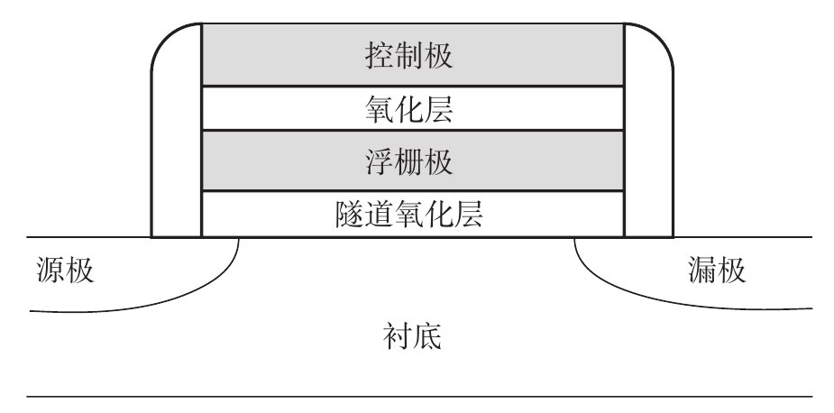

**图5-1 浮栅晶体管结构（原书图5-1 · 局部截图）**

存储单元的写入（往浮栅注入电子）与擦除（把电子抽走）本质都是靠衬底/控制极间的强电场实现。注入的电子越多，晶体管导通所需的**阈值电压（Vth）越高**。

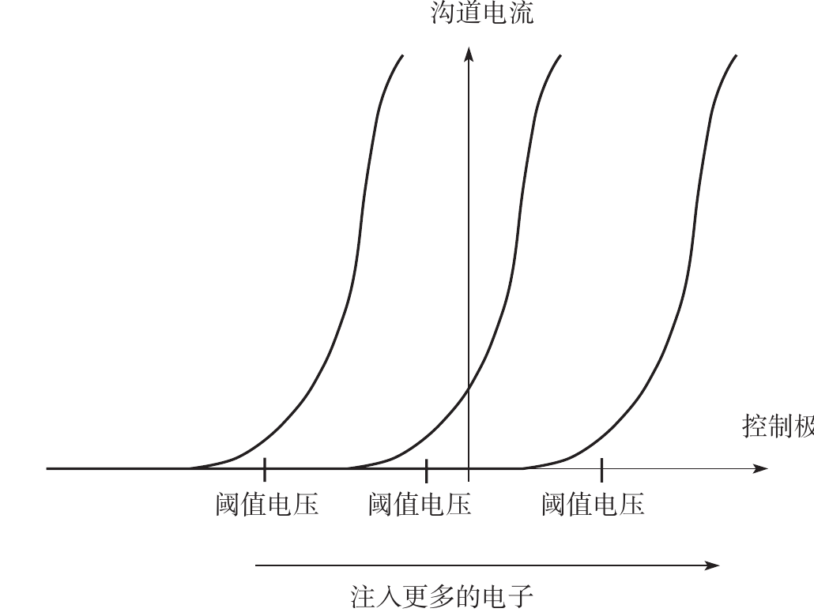

**图5-2 晶体管阈值电压随着浮栅极注入电子的增多而增大（原书图5-3 · 局部截图）**

### 5.1.2 闪存类型：SLC / MLC / TLC / QLC

让一个存储单元存更多位，本质是把“有没有电子”细分成更多状态：

- **SLC**：1bit，2 种状态；
- **MLC**：2bit，4 种状态；
- **TLC**：3bit，8 种状态；
- **QLC**：4bit，16 种状态。

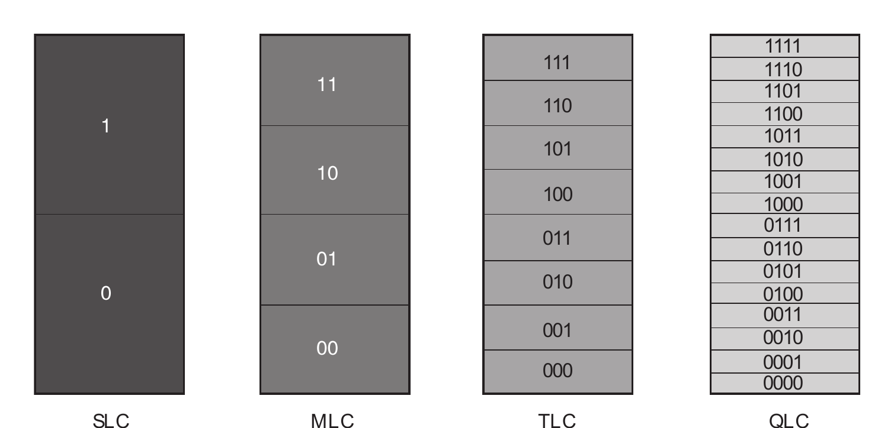

**图5-3 不同闪存类型状态的状态划分和编码示例（原书图5-4 · 局部截图）**

状态越多，相邻状态的阈值电压分布离得越近，越容易读错，所以纠错也要越强。

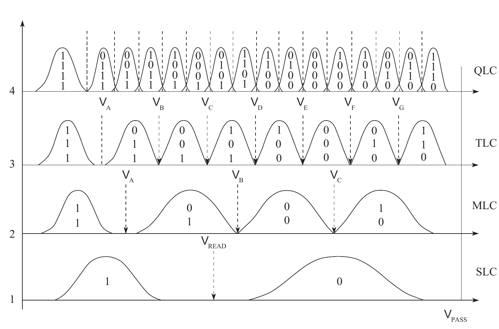

**图5-4 不同类型闪存的阈值电压分布示意图（原书图5-5 · 局部截图）**

**表5-1 SLC / MLC / TLC / QLC 参数比较（参数因制程、厂商而异，仅供参考）**

| 参数 | SLC | MLC | TLC | QLC |
| --- | --- | --- | --- | --- |
| 读取时间/μs | 20～25 | 55～110 | 75～170 | 120～200 |
| 写入时间/μs | 50～100 | 400～1 500 | 800～2 000 | 2 000～3 000 |
| 擦除时间/ms | 2～5 | 5～10 | 10～15 | 15～20 |
| 擦写次数 | 100 000 | 15 000 | 3 000～5 000 | 800～1 500 |
| 比特成本 | 高 | 低 | 更低 | 最低 |

影响：密度越高 → 性能越差、可靠性越低、寿命越短。纠错也从 BCH 走向 LDPC，码字从 1KB 走向 4KB。

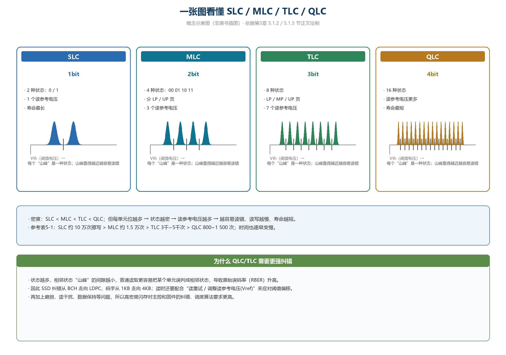

**图5-5 从 SLC 到 QLC：每单元位越多、状态越密、寿命越短（概念示意图，非原书插图）**

### 5.1.3 闪存组织结构

- **Die（也叫 LUN）**：接收、执行命令的基本单元；一个 Die 各 Plane 可并行（有一定限制）；
- **Plane**：一个 Die 分若干 Plane（早期 2 个、主流 4 个、已有 6 个），每个 Plane 有独立**页缓存 + 闪存缓存**（大小约等于一个闪存页）；
- **Block（块）**：擦除的最小单元；
- **Page（页）**：读/写的最小单元；主流页大小 **16KB**（实际比 16KB 大，额外空间存校验信息）。

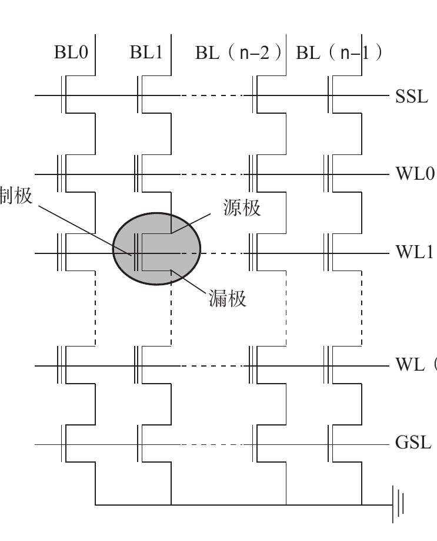

**图5-6 闪存块组织结构（原书图5-6 · 局部截图）**

横向是 m 条字线（WL），纵向是 n 条位线（BL）。一条字线包含若干页：SLC 一个 WL=1 页；MLC=2 页（LP/UP）；TLC=3 页（LP/MP/UP）。

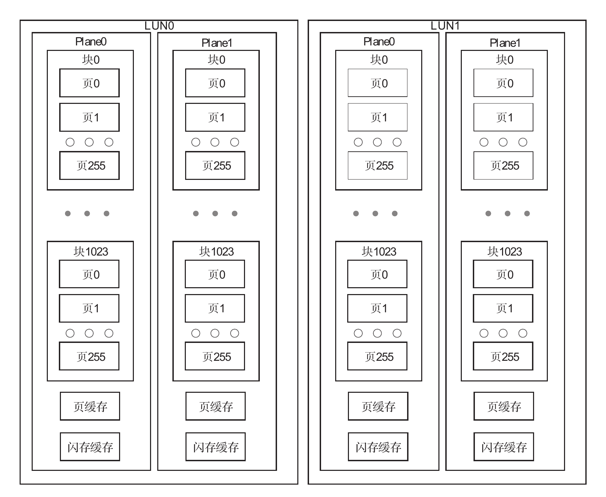

**图5-7 闪存内部存储组织架构（原书图5-7 · 局部截图）**

为了支持**一次性编程（one-pass programming）**（如 TLC 一次把 LP/MP/UP 三个页的数据一起编程到目标状态），现在闪存内部通常有多个页缓存（至少 3 个）。

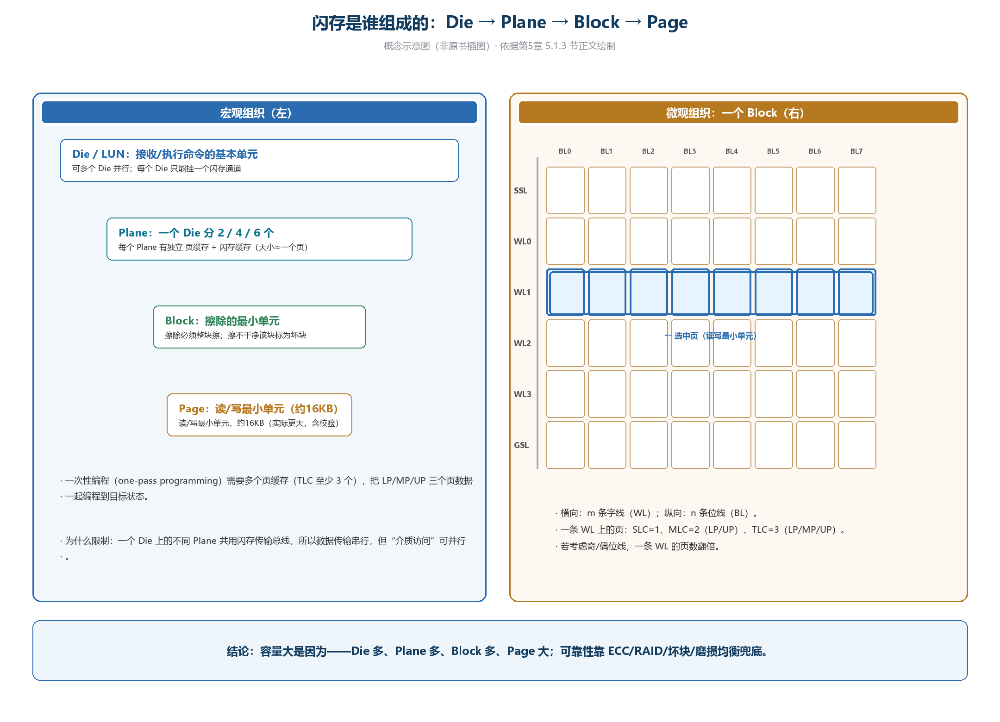

**图5-8 闪存是谁组成的：Die → Plane → Block → Page（概念示意图，非原书插图）**

### 5.1.4 擦、写、读操作

- **擦除**：最小单元是块。所有字线控制极加 0V、衬底加高电压，把块内所有浮栅电子“吸”出；需验证是否擦干净，擦不干净超过阈值则标为坏块。
- **写入**：最小单元是页。目标字线加 V_PROG，其余字线加 V_PASS（让未编程单元导通）；要抑制编程的位线加 V_INH，只有写“0”的位线保持 0V 注入电子。采用**增量步进脉冲编程（ISPP）**：小电压开始→验证→加电压，避免一次注入过多电子导致状态“过头”。

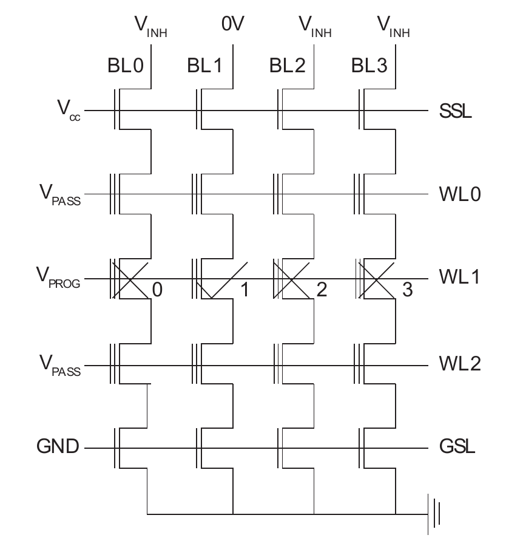

**图5-9 写入操作原理（原书图5-9 · 局部截图）**

- **读取**：最小单元是页。其他字线加 V_PASS，目标字线加读参考电压；位线放电=导通（1），保持充电=截止（0）。读 LP 只需一次参考电压，读 UP/MP 需要多次。

读时给其他字线加较大 V_PASS，会让未被读取的页轻微“写入”，这就是**读干扰**的来源。

**为什么非选中字线要加 Vpass**：NAND 串是多个存储单元串联，读/写某个字线时，同一串中的其他未选中单元必须导通，否则电流路径会被这些单元的阈值电压挡住。所以给未选中字线加一个“导通电压”Vpass。

- **太低不行**：Vpass 必须高于已编程单元的最大阈值电压（MLC 应用中典型约 7V 或更高），否则最“高阈值”的单元不通，电流被阻断，读不到正确状态；
- **太高也不行**：反复施加过高 Vpass 会让相邻单元被“软编程”，造成读干扰 / Vpass 干扰；
- **应对**：相邻字线有时用不同电压或斜坡缓升，并配合读重试、Vref 校准和数据刷新来管理。

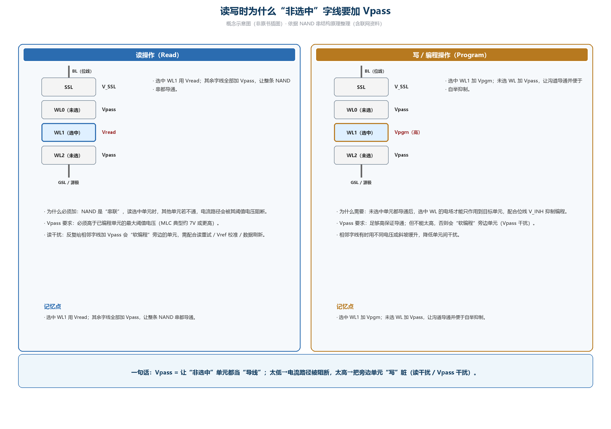

**图5-10 读写时为什么“非选中”字线要加 Vpass（概念示意图，非原书插图）**

### 5.1.5 阈值电压分布图

统计一个闪存页所有存储单元的阈值电压，可画出“单元个数-阈值电压”分布图，相邻状态之间靠**读参考电压（Vref）**区分。

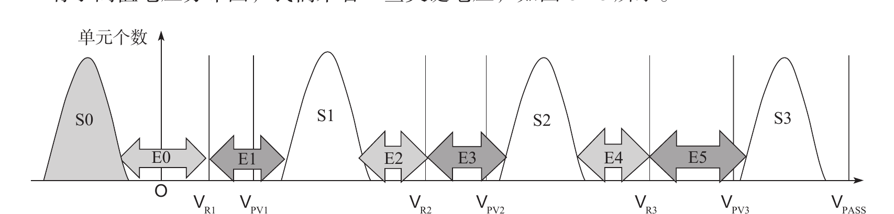

**图5-11 阈值电压分布图（原书图5-15 · 局部截图）**

- 状态“山峰”越窄越稳；若山峰相对 Vref 发生偏移（左移/右移），就可能导致读错；
- **数据保持问题**让分布整体左移；**读干扰**让分布整体右移。

---

## 5.2 闪存可靠性问题

### 5.2.1 磨损（擦写损耗）

每擦写一次，隧道氧化层都会受损，原始错误比特率（RBER）上升；不同闪存块、不同页的 RBER 也可能存在差异。

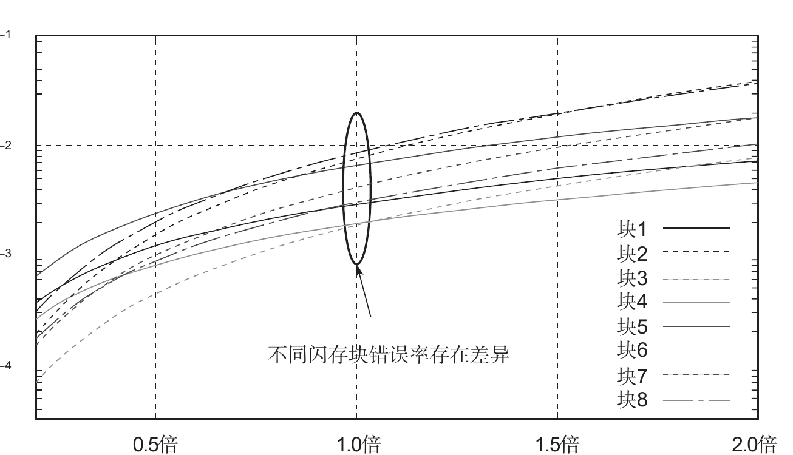

**图5-12 闪存原始比特错误率随着擦写次数的增多而升高（原书图5-17 · 局部截图）**

### 5.2.2 读干扰

读一个页时，其他字线加 V_PASS，这些未读页会被“轻微编程”；读的次数多到一定程度，数据由“1”变“0”，发生位翻转。

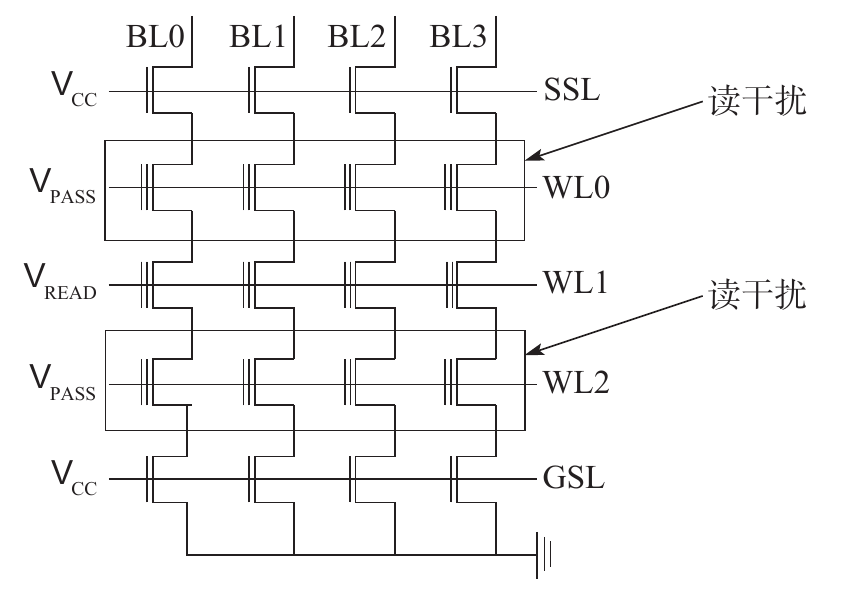

**图5-13 读干扰原理（原书图5-18 · 局部截图）**

### 5.2.3 写/编程干扰

编程某字线时，相邻字线/相邻位线上的存储单元可能被意外注入电子；可通过位线加 V_INH 抑制编程干扰。

### 5.2.4 数据保持

浮栅中的电子会随时间经隧道氧化层泄漏；擦写次数越多，氧化层越“透风”，电子逃逸越快，阈值电压整体**左移**。

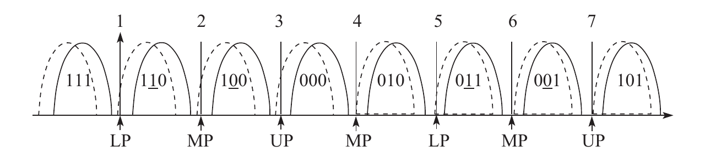

**图5-14 数据保持问题使闪存阈值电压分布整体左移（原书图5-23 · 局部截图）**

### 5.2.5 存储单元之间的干扰

相邻浮栅晶体管之间存在寄生电容，一个存储单元电荷变化会影响邻单元；不同制程/顺序编程会显著影响干扰程度。一般通过按 WL 顺序编程、ECC 纠错等方式缓解。

---

## 5.3 数据可靠性问题的解决方案

SSD 在系统层面通过**软硬件协同**把 RBER 压到可接受的 UBER 范围：

- **更强的 ECC**：BCH → LDPC，码字 1KB → 4KB，容错力更强；
- **RAID 5**：把用户数据与奇偶校验构成条带，ECC 救不回的单错可用异或恢复（`Parity = A+B+C+D+E+F+G`，恢复 `C = Parity+A+B+D+E+F+G`）；
- **读重试 / Vref 校准**：阈值电压偏移时，尝试不同读参考电压再读；
- **坏块管理**：擦除/写入失败的块标记为坏块，用预留空间替换；
- **磨损均衡**：让各块尽量均匀擦写，延长整盘寿命；
- **端到端数据保护**：主机→控制器→闪存全路径校验，防止静默损坏。

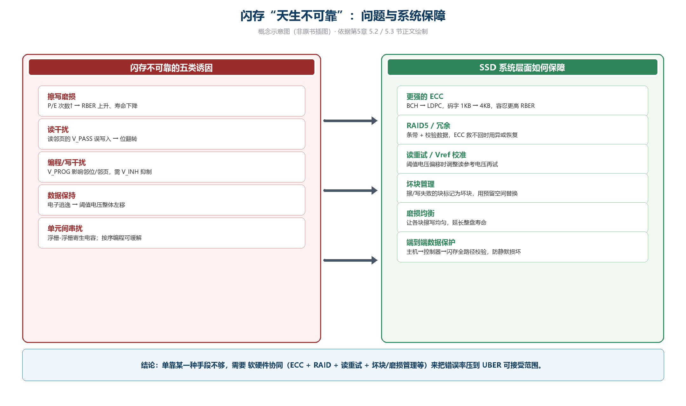

**图5-15 闪存可靠性问题与系统保障（概念示意图，非原书插图）**

---

## 5.4 3 个与性能相关的闪存特性

这几个特性的本质都是“**提高并发度**”，因为一个 Die 只能挂在一个闪存通道上，同一 Die 的不同 Plane 共用传输总线，但可以并行访问介质。

### 5.4.1 多 Plane 操作

把多个 Plane 的数据先放到各自缓存，再统一写入：

- **多 Plane 写**：假设 t_PROG=1.5ms、t_X=50μs，单 Plane 写两页 = (1.5ms+50μs)×2；多 Plane = 1.5ms + 50μs×2，写入时间几乎减半；
- **多 Plane 读**：假设 t_R=t_X=50μs，单 Plane 读两页 = 50μs×4 = 200μs；多 Plane = 50μs×2 + 50μs = 150μs（75%）。

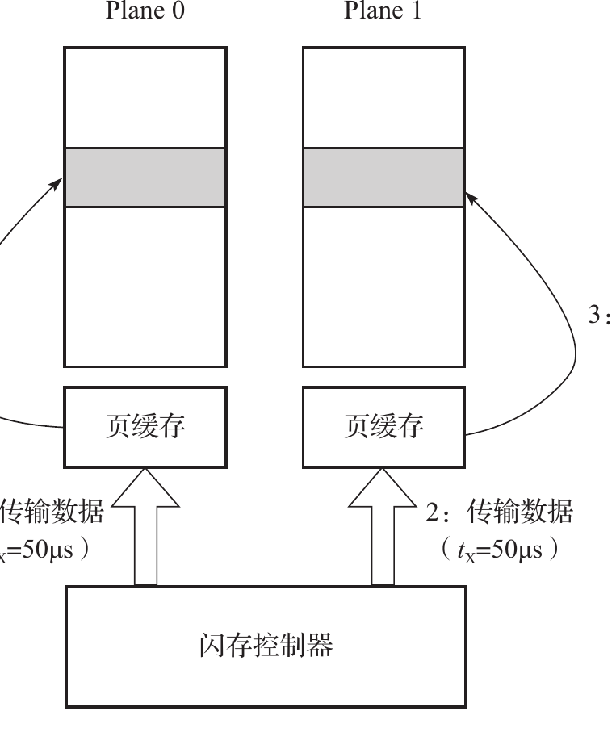

**图5-16 多 Plane 写操作示意图（原书图5-29 · 局部截图）**

### 5.4.2 缓存读写操作

利用“页缓存 + 闪存缓存”实现流水线：

- **缓存读**：传前一个页（闪存缓存→主控）的同时，从介质读下一个页到页缓存，隐藏传输时间；
- **缓存写**：写前一个页（页缓存→介质）的同时，把下一个页数据从主控传到闪存缓存；
- 3 页读取：非缓存读 =(t_R+t_X)×3；缓存读当 t_R>t_X 时约 =3×t_R+t_X，当 t_R<t_X 时约 =t_R+3×t_X，总时间更少。

### 5.4.3 异步 Plane 操作

- 多 Plane 操作要求“不同 Plane 上的页编号一致”，所以主要用于写入与顺序读，**对随机读基本无效**；
- 为解决单 Die 随机读取并发度低的问题，引入**异步 Plane**（长江存储 AMPI / 部分厂商 iWL）：同一 Die 内不同 Plane 可独立并行执行随机读，单 Die 随机并发度从 1 变为 Plane 个数（如 2 个 Plane 并行度翻倍）。

---

## 5.5 3D 闪存

### 5.5.1 为什么做 3D

逻辑上让每单元存更多位（SLC→QLC），物理上用更先进制程；但制程越先进，单元间干扰越严重（图5-34 的“房间越挤越难住”）。于是把平面“盖成高楼”——**3D NAND**，让同样面积晶圆承载更多数据，且制程可以“往回走”。

### 5.5.2 3D 存储单元：CT（电荷捕获）

3D 时代主流存储单元从 **FG（浮栅，导体材料）** 转向 **CT（电荷捕获，绝缘材料）**：

- FG 的浮栅极是导体，电子可在里面自由移动，像“水”；CT 的电荷捕获层布满了“陷阱”，电子很难移动，像“奶酪”；
- CT 优势：对隧道氧化层不敏感、单元间干扰更弱、编程电压更低、寿命更长；
- 擦除方式：FG 用 F-N 隧道效应抽电子；CT 一般用**热注入空穴**中和电子。

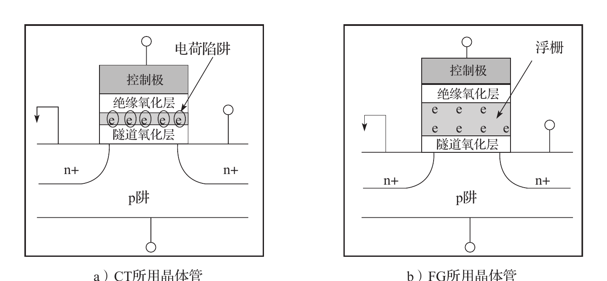

**图5-17 CT 所用晶体管（左）和 FG 所用晶体管（右）对比（原书图5-37 · 局部截图）**

### 5.5.3 3D 闪存组织结构

3D 闪存把 2D 的“块”立起来：一个块由 M+1 条字线、N+1 条位线构成（Z-Y 所在的面就是一个块），沿 X 方向排列更多块组成 3D 闪存。

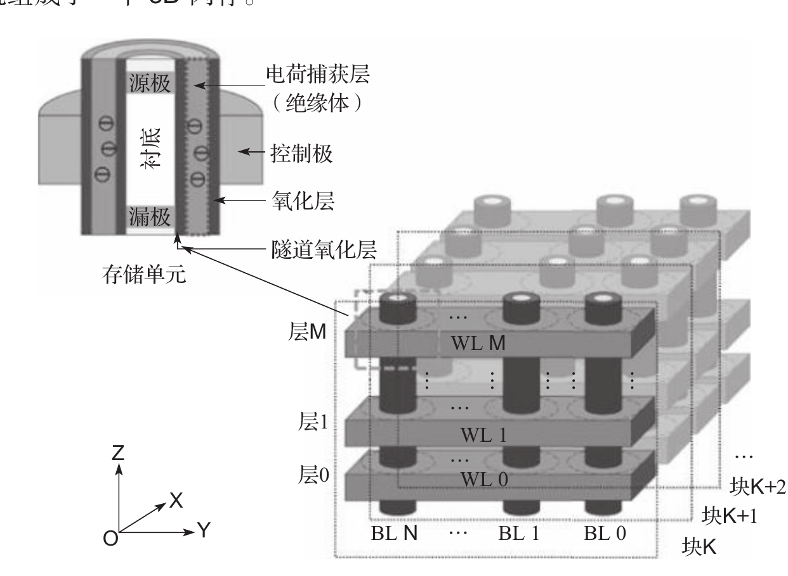

**图5-18 3D 闪存组织结构（原书图5-40 · 局部截图）**

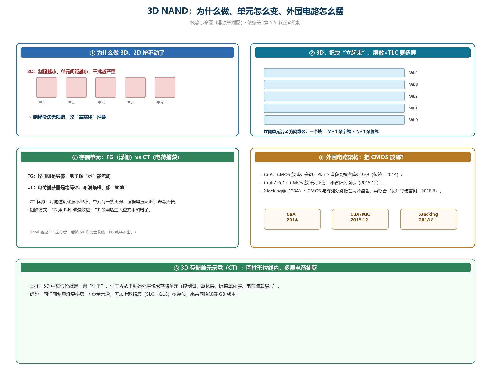

**图5-19 3D NAND：为什么做、单元怎么变、外围电路怎么摆（概念示意图，非原书插图）**

### 5.5.4 3D 闪存外围电路架构

随着 Plane 增多，外围电路面积变大，不能挤占存储阵列：

- **CnA（CMOS next Array）**：传统做法，CMOS 放在阵列旁边、共用衬底；Plane 增多会压缩阵列面积；
- **CuA / PuC（CMOS/PERI under Cell）**：把 CMOS 放到存储阵列下方，不占阵列面积，可支持更多 Plane；
- **Xtacking®（CBA，CMOS bonding Array）**：长江存储首创，CMOS 与存储阵列分别在两片晶圆上加工，再键合，代表先进发展方向。

时间轴：2014 年传统架构 → 2015 年 12 月 CuA/PuC → 2018 年 8 月 Xtacking。

---

## 小结

- **单元**：浮栅晶体管，靠“电子是否有/多少”表示数据；SLC/MLC/TLC/QLC 每单元位越多，状态越密、寿命越短、纠错越强；
- **组织**：Die/LUN → Plane → Block（擦除单位）→ Page（读写单位，约 16KB）；
- **可靠性**：磨损、读/写干扰、数据保持、单元串扰；对策=ECC + RAID5 + 读重试/Vref 校准 + 坏块管理 + 磨损均衡；
- **性能**：多 Plane、缓存读写、异步 Plane 都是提高并发度；
- **3D**：FG→CT、2D→3D 堆叠、CuA/PuC→Xtacking，都是“把密度做上去、把成本做下来”的思路。
