# 第 6 章 FTL 详解 · 重点总结

> 依据《深入浅出SSD：固态存储核心技术、原理与实战（第 2 版）》第 6 章原文整理。插图均为从原书 PDF 裁切的局部图（非整页截图、不含原书图注）；标“概念示意图”者为辅助理解绘制的示意图，非书中原图。

---

## 0. 本章主线

FTL（Flash Translation Layer，闪存转换层）是 SSD 的“翻译官”和“管家”：把主机看到的逻辑地址（LBA）映射到闪存物理地址，并管理垃圾回收、磨损均衡、坏块、掉电、Trim、读干扰/数据保持等。

本章按“**映射 → 垃圾回收 → 解除映射 → 磨损均衡 → 掉电/坏块 → SLC 缓存 → 读写干扰**”展开。

---

## 6.1 FTL 综述

- FTL 位于主机（文件系统/底层驱动）与闪存之间，按页/块做逻辑→物理地址转换；
- 早期 FTL 可放在**主机端**，现代 SSD 普遍把 FTL 放在**设备端**；
- 因为闪存“不能覆盖写、按块擦除”，FTL 要额外做：垃圾回收（GC）、磨损均衡、坏块管理、掉电恢复、Trim、读干扰/数据保持处理等。

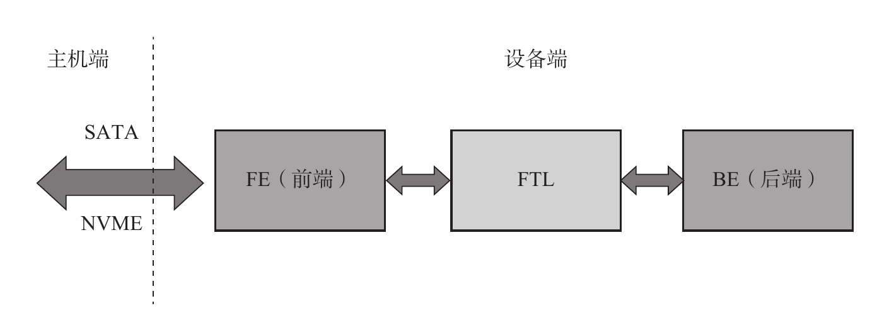

**图6-1 FTL 在设备端（原书图6-2 · 局部截图）**

---

## 6.2 映射管理

### 6.2.1 映射的种类

| 对比项 | 块映射 | 页映射 | 混合映射 |
| --- | --- | --- | --- |
| 映射单元 | 闪存块 | 闪存页 | 块 + 页 |
| 顺序写/读 | 好 | 好 | 好 |
| 随机写 | 很差 | 好 | 差 |
| 随机读 | 好 | 好 | 好 |
| 映射表大小 | 小 | 大 | 一般 |

主流 SSD 采用**页映射**（随机写性能好）；其他映射可作为补充讨论。

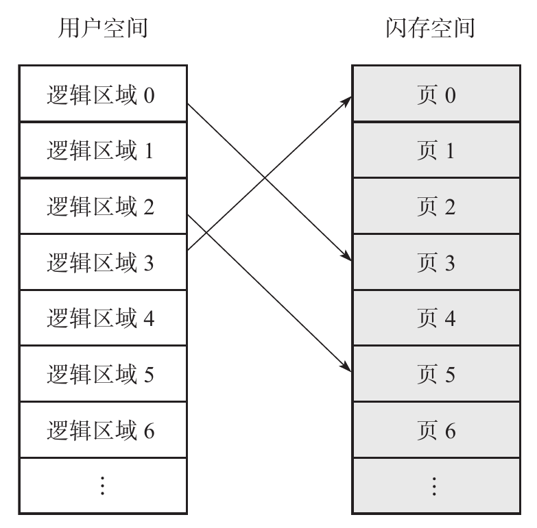

**图6-2 页映射示例（原书图6-4 · 局部截图）**

### 6.2.2 映射的基本原理

- 用户以 **LBA（逻辑块地址，逻辑页）** 访问，闪存以 **物理页（PBA）** 为基本单元读/写；
- 每次写入，固件找一个空闲物理页把数据写入，并记录 **L2P（逻辑→物理）映射关系**；读时查表定位。
- **映射表大小**：假设 256GB、4KB 逻辑页 → 64M 条映射；每条 4B → 映射表约 256MB ≈ 容量/1024。

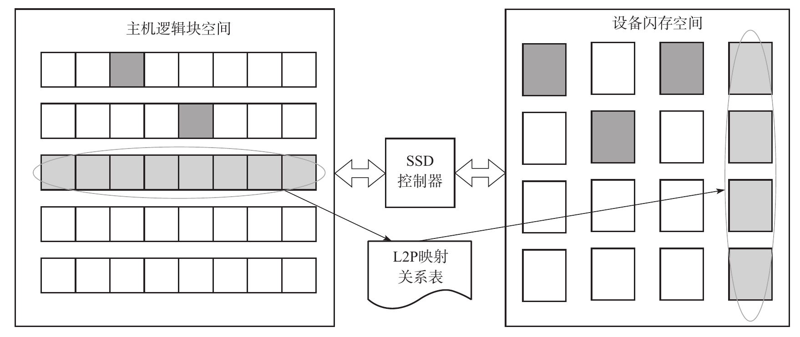

**图6-3 逻辑页到物理页的映射（原书图6-6 · 局部截图）**

### 映射表的三种存放架构

1. **带板载 DRAM**：映射表全部/大部分缓存在 DRAM，命中即读，只访问一次闪存；

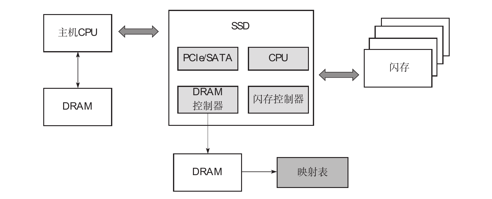

**图6-4 带 DRAM 的 SSD 架构（原书图6-7 · 局部截图）**

2. **不带 DRAM（DRAM-less）**：采用**两级映射表**——一级表常驻 SRAM（存映射块的物理地址），二级表（L2P）大部分放在闪存；未命中时要先读二级表，等于多读一次闪存；

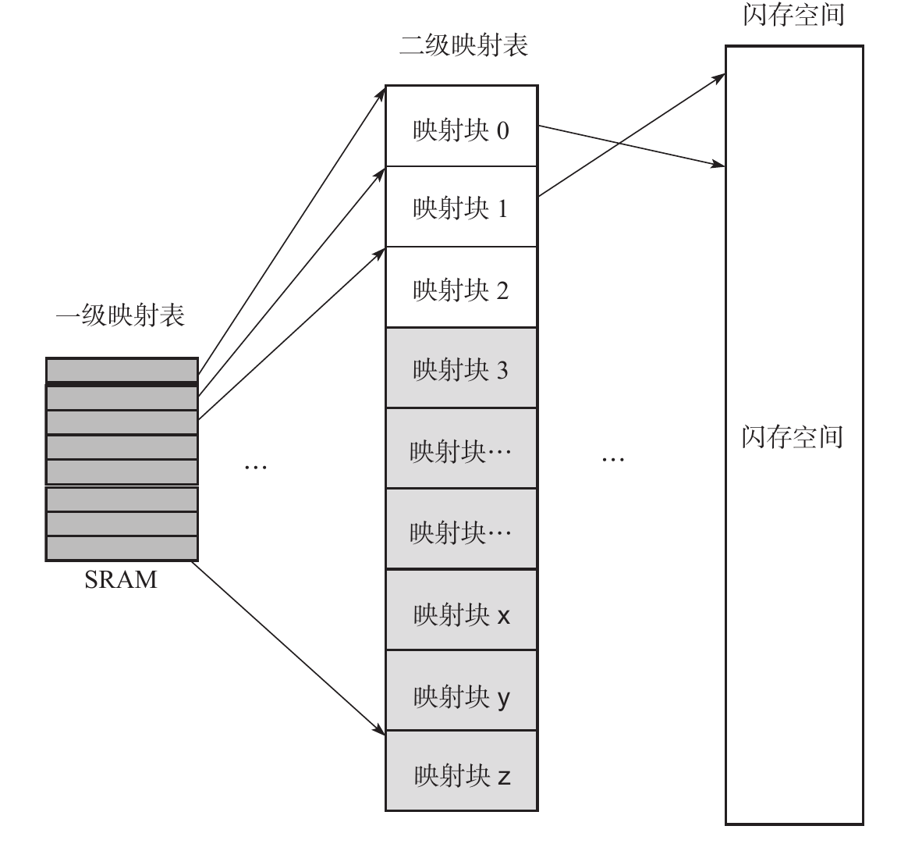

**图6-5 两级映射表（原书图6-8 · 局部截图）**

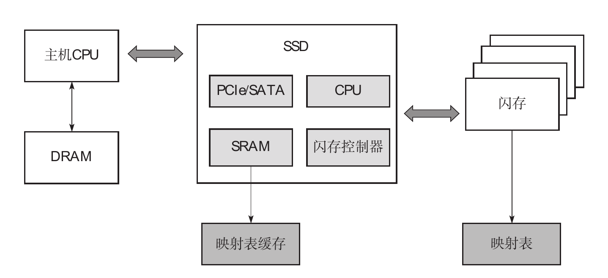

**图6-6 不带 DRAM 的 SSD 架构（原书图6-9 · 局部截图）**

3. **HMB（Host Memory Buffer）**：借用主机内存存放映射表，成本低于板载 DRAM，比 DRAM-less 少访问一次闪存。

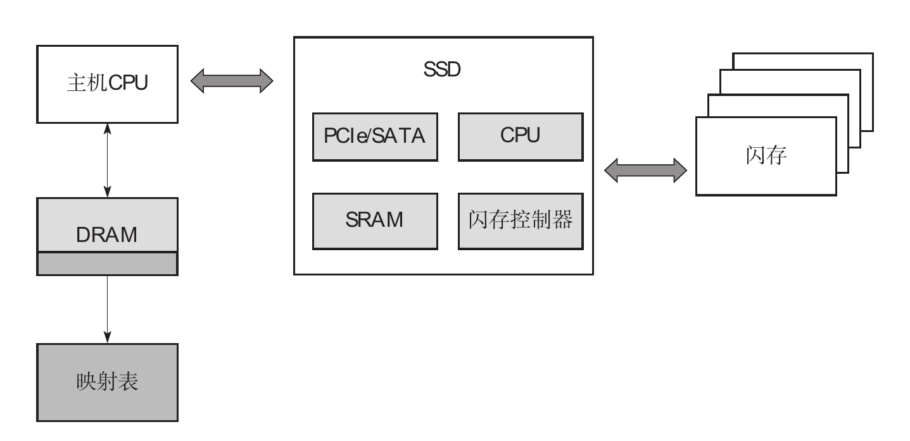

**图6-7 基于 HMB 的 SSD 架构（原书图6-10 · 局部截图）**

不同架构查询映射表的时延对比（定性）：**带 DRAM < HMB < 不带 DRAM**；老接口（SATA/UFS/eMMC）整体时延更大。

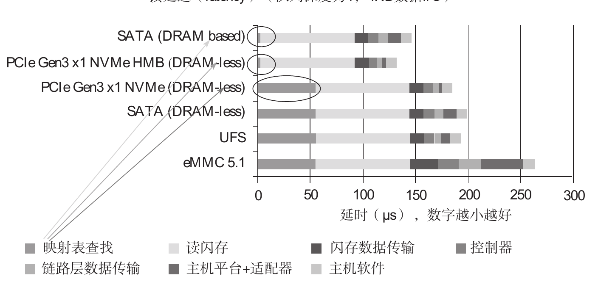

**图6-8 不同 SSD 架构下查询映射表的时延对比（原书图6-12 · 局部截图）**

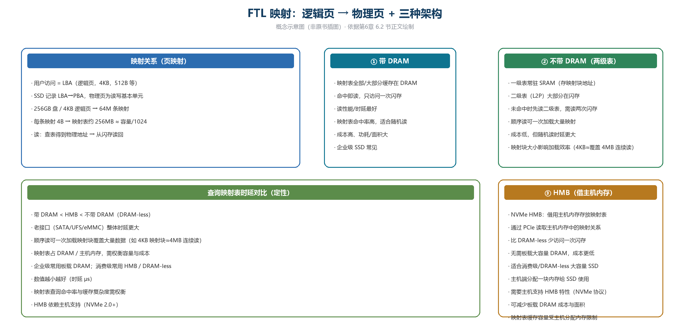

**图6-9 FTL 映射与三种架构（概念示意图，非原书插图）**

---

## 6.3 垃圾回收（GC）

### 6.3.1 垃圾回收原理

- 闪存不能覆盖写，主机修改数据时新数据写到**新的物理页**，旧页变成无效（垃圾）；
- GC 时选“**垃圾多、有效页少**”的块作为源块，把有效页搬到空闲块，再整块擦除，变成可写块。

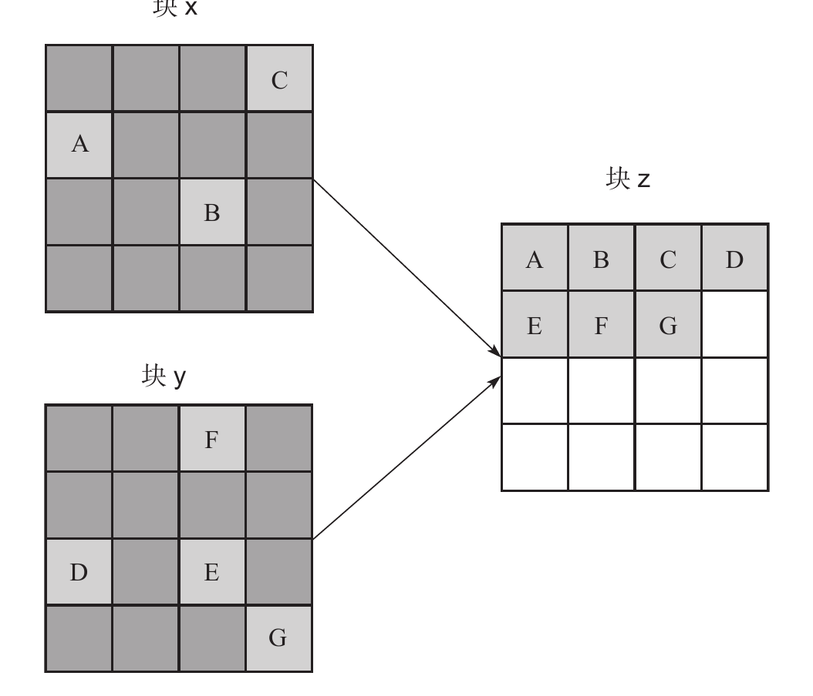

**图6-10 垃圾回收示例（原书图6-18 · 局部截图）**

### 6.3.2 写放大与 OP

- **写放大（WA）= 实际写入闪存量 ÷ 主机写入量**；
- 随机写/碎片多 → GC 搬移多 → WA 大 → 寿命缩短、性能下降；
- **OP（预留空间）越大** → 空闲块越多 → GC 触发越少 → WA 越低 → 耐写度（TBW）越高；但用户可用容量变少。

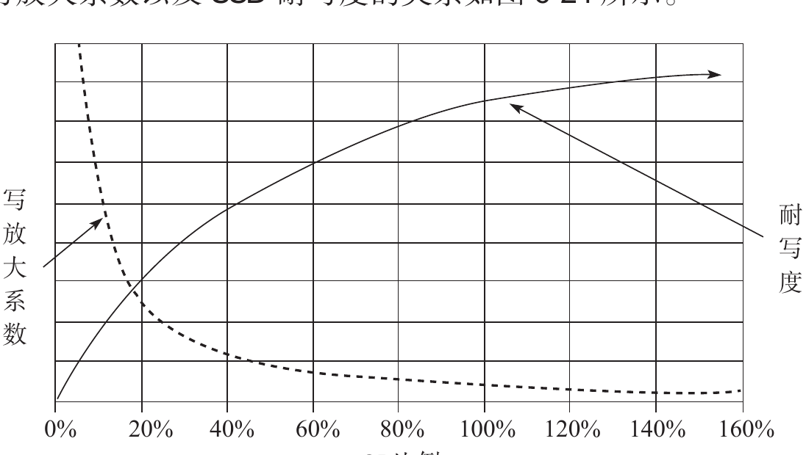

**图6-11 OP 大小对写放大系数和 SSD 耐写度的影响（原书图6-24 · 局部截图）**

### 6.3.3 垃圾回收实现

- FTL 通常维护三张表：**L2P（逻辑→物理映射）、VPBM（有效页位图）、VPC（块有效数据计数）**；
- 通过 VPC/位图快速判断“哪个块垃圾最多、有效页最少”，优先回收；
- **GC 时机**：如写入达到高水位（HMS）时触发，让性能尽量平稳。

### 6.3.4 垃圾回收时机

过早回收会频繁搬移、消耗寿命；过晚回收会空间不足、性能波动。固件需要根据剩余空间/高水位动态选择时机。

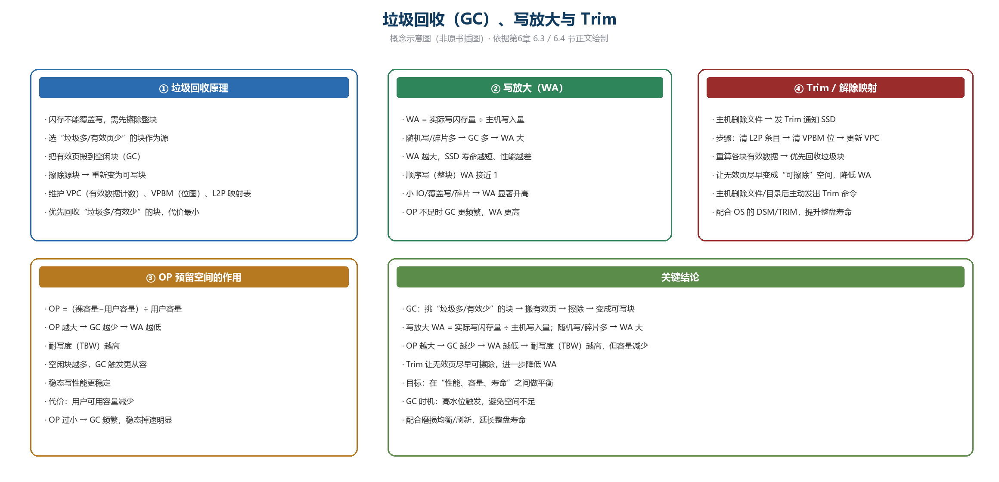

**图6-12 垃圾回收、写放大与 Trim（概念示意图，非原书插图）**

---

## 6.4 解除映射关系（Trim）

- 主机删除文件后发出 **Trim**，通知 SSD 这些 LBA 不再有效；
- FTL 处理流程：**清除 L2P 条目 → 清除 VPBM 对应位 → 更新 VPC → 重复直到处理完每个 LBA → 按新的 VPC 重新计算 GC 优先级 → 回收全垃圾块 → 擦除**。

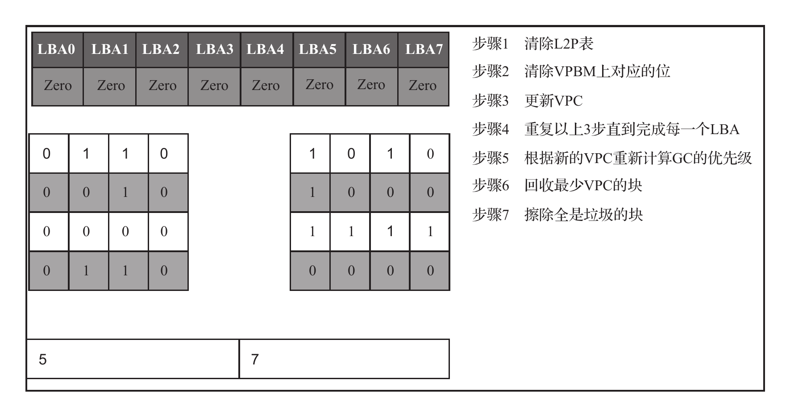

**图6-13 FTL 处理 Trim 命令的流程（原书图6-37 · 局部截图）**

---

## 6.5 磨损均衡

- **冷数据**：不常更新（系统文件、视频、只读文件）；**热数据**：频繁更新；
- **年老的块**：擦写次数（EC）多；**年轻的块**：EC 少；
- **动态磨损均衡**：热数据写到年轻的块；
- **静态磨损均衡**：把冷数据搬到年老的块，让“劳苦功高”的年老块休息，避免个别块因冷数据占用而擦写不均衡。

---

## 6.6 掉电恢复

- SSD 定期给内部状态“拍照”（Checkpoint/快照），把元数据、映射关系保存到闪存；
- 异常掉电后，用最近一次快照 + 日志恢复一致状态，避免 L2P 与数据不一致、用户数据损坏。

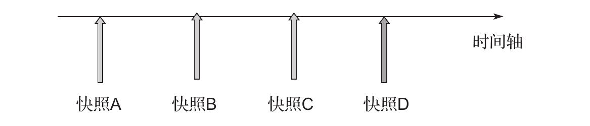

**图6-14 定期给 SSD 拍照（原书图6-39 · 局部截图）**

---

## 6.7 坏块管理

- **出厂坏块**：闪存出厂时就存在；通过坏块标记建立**坏块表**；
- **运行期坏块**：擦除/写失败超阈值即标为坏块；
- 管理策略：**略过**坏块 / **重映射**到好块（块级重映射表）来替换，保证写入不被坏块打断。

---

## 6.8 SLC 缓存

- **强制 SLC 写入**：用户数据先写 SLC，再迁移到 TLC/QLC；早期 MLC 非一次性编程时用于防“数据带坏”；
- **SLC 缓存分类**：
  - **静态**：固定块做 SLC，寿命好但占用容量/OP；
  - **动态**：TLC/QLC 块在 SLC 与高容量模式间按需切换，性能和容量平衡；
  - **混合**：一部分固定 + 一部分动态。
- **读写过程**：热数据先写 SLC 缓存，冷数据直接写 QLC；用 **LRU 链表**识别热数据；数据迁移时避免把热数据过早迁出，否则会增大写放大。

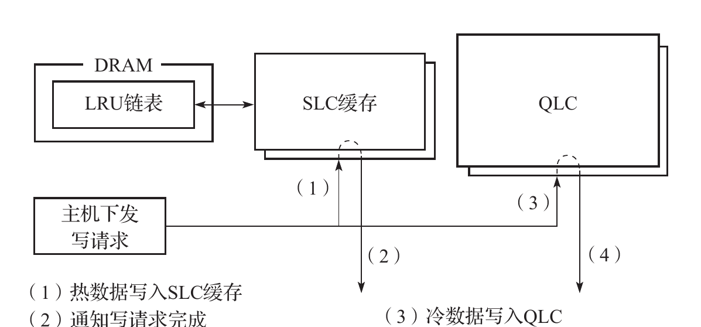

**图6-15 冷热数据写入过程（原书图6-45 · 局部截图）**

---

## 6.9 读干扰与数据保持

### 1. 读干扰（RD）

- 读一个页时需要给其他字线加较高电压（Vpass），会轻微“编程”相邻页；读得多了可能 **1→0** 翻转；
- FTL 记录每个块的**读次数**，超过阈值就**刷新**该块（搬到新块，读次数归零）；
- 阈值应**随 PE 增大而减小**（闪存越老越不耐读干扰）；刷新最好用**非阻塞**方式（与其他操作并行），避免长时延。

### 2. 数据保持（DR）

- 浮栅电子随时间泄漏，导致 **0→1** 翻转；闪存越老、保存时间越长越容易出错；
- 同样需要监控/刷新，配合 ECC 和读重试把错误控制在可接受范围。

---

## 小结

- **FTL 的核心**：LBA→PBA 映射，让“不能覆盖写”的闪存像普通硬盘一样用；
- 映射表存放：板载 DRAM（快） / DRAM-less 两级表（省成本） / HMB（折中）；
- **GC** 负责搬有效页、擦除垃圾块；**OP** 大小决定写放大和耐写度；
- **Trim** 让无效页尽早可擦除，降低写放大；
- **可靠性**：磨损均衡、坏块管理、掉电快照、SLC 缓存、RD/DR 刷新，都是在平衡“性能、容量、寿命”。
