# 第 7 章 ECC 原理 · 重点总结

> 依据《深入浅出SSD：固态存储核心技术、原理与实战（第 2 版）》第 7 章原文整理。插图均为从原书 PDF 裁切的局部图（非整页截图、不含原书图注）；标“概念示意图”者为辅助理解绘制的示意图，非书中原图。

---

## 0. 本章主线

ECC（纠错编码）解决“闪存天然会出错”的问题。本章按“**为什么会出错 → 通信模型 → 纠错编码思想 → LDPC → LDPC 解码**”展开。

---

## 7.1 信号和噪声

- 通信过程本质是“发送信息 → 信道 → 接收信息”；信道中的**噪声/干扰**会让接收端判断错误（0→1、1→0 或数据被抹掉）；
- 纠错编码在“信道编码”阶段处理：发送端增加冗余，接收端用校验信息恢复原始数据。

---

## 7.2 通信系统模型

通信系统框图：**信息源 → 编码器 → 发送器 → 信道 → 接收器 → 解码器 → 信息目的地**；信道旁有**噪声源**。

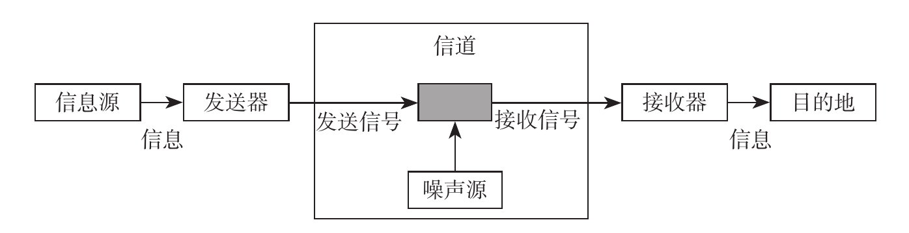

**图7-1 通信系统框图（原书图7-1 · 局部截图）**

### 两种常见信道模型

- **BSC（二进制对称信道）**：以概率 `p` 把 0→1 或 1→0（翻转）；
- **BEC（二进制删除信道）**：以概率 `ε` 把比特“删除/抹掉”，接收端知道“缺失”但不一定知道值。

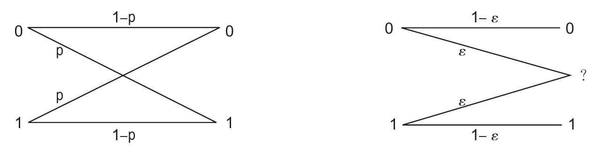

**图7-2 BSC 模型（原书图7-2 · 局部截图）**

### 编码与码率

- 信息位 `k` + 校验位 = 码字 `n`；
- **Code rate = k / n**：冗余越多纠错越强，但有效吞吐越低；理论上可在信道容量 C 之内逼近 0 错误。

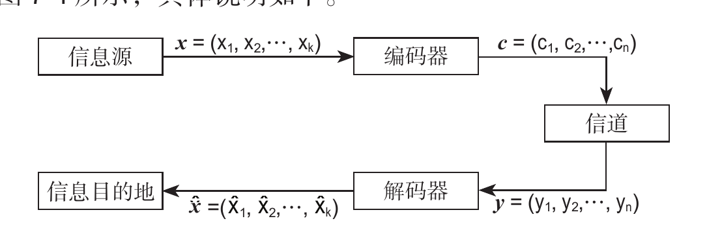

**图7-3 信息编码解码过程（原书图7-4 · 局部截图）**

---

## 7.3 纠错编码的基本思想

### 7.3.1 编码距离

- 两个码字之间不同位的个数叫**汉明距离**；编码的**最小距离 d_min** 决定纠错能力；
- 一般能纠 `t = floor((d_min − 1) / 2)` 位错误：奇偶校验 d_min=2 只能检 1 位；重复 3 遍 d=3，可纠 1 位。

### 7.3.2 奇偶校验（异或）

把信息位做异或得到 1 位校验位，能发现“奇数个位出错”。这是线性纠错码的基石。

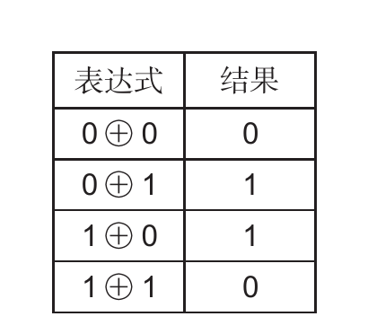

**图7-4 异或运算表达式（原书图7-5 · 局部截图）**

### 7.3.3 校验矩阵 H 与生成矩阵 G

- **生成矩阵 G**：把信息位变码字，`c = x·G`；
- **校验矩阵 H**：校验 `H·c^T = 0`；不为 0 说明有错，可依据错误图样纠正；
- **LDPC** 就是“校验矩阵 H 非常稀疏”的线性分组码。

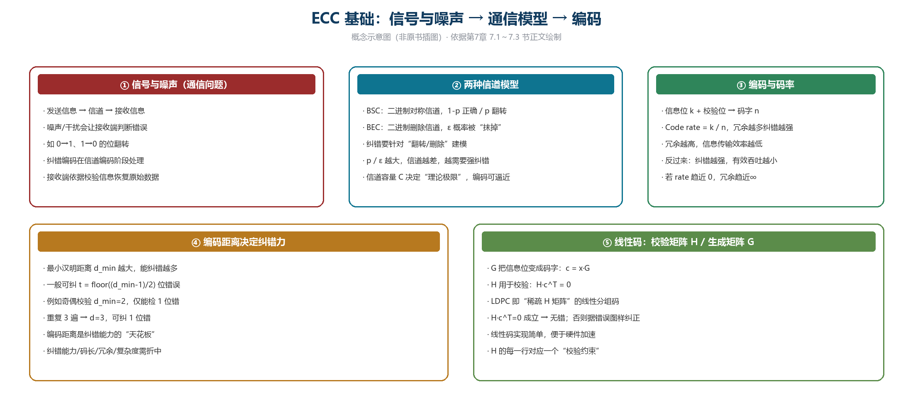

**图7-5 ECC 基础：信号噪声 → 信道模型 → 编码（概念示意图，非原书插图）**

---

## 7.4 LDPC 原理简介

- **LDPC（低密度奇偶校验）**：校验矩阵 H 中“1”很少（稀疏），所以用 Tanner 图表示时边数少；
- **Tanner 图**：变量节点（圆）↔ 校验节点（方）；边代表“某个变量参与某条校验方程”；
- 码长越大纠错越强：SSD 从 1KB LDPC 走向 **4KB LDPC**，以匹配高密度 NAND 的更高原始误码率。

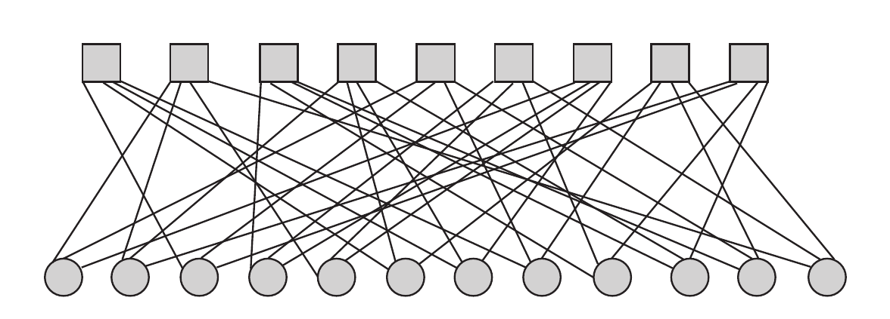

**图7-6 Tanner 图（原书图7-6 · 局部截图）**

---

## 7.5 LDPC 解码

### 7.5.1 Bit-flipping（硬判决）

- 先硬判决 0/1；检查每个校验节点是否满足 `H·c=0`；
- 不满足的变量节点**翻位**，反复迭代直到满足或达到最大迭代；实现简单、适合硬件，但纠错力相对较弱。

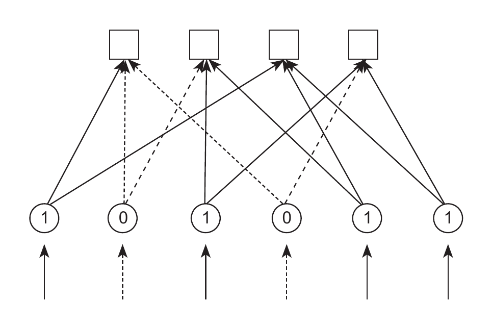

**图7-7 Bit-flipping 步骤示意（原书图7-7 · 局部截图）**

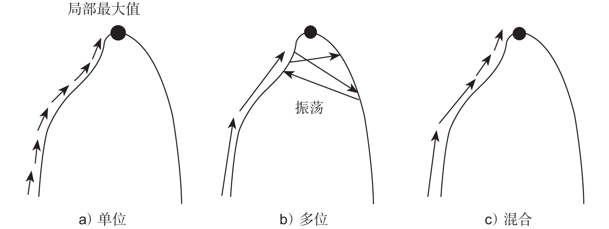

**图7-8 几种 Bit-flipping 算法收敛示意图（原书图7-11 · 局部截图）**

### 7.5.2 和积（信息传播）算法（软判决）

- 用**概率 / 对数似然比（LLR）** 表示“0 或 1 的可能性”；
- 消息在变量节点 ↔ 校验节点之间来回传播；
- **校验节点更新**：根据相连变量节点消息更新；**变量节点更新**：综合信道观测与校验信息；
- 迭代到收敛或达到最大迭代次数；4K LDPC 多采用软判决，纠错能力更强。

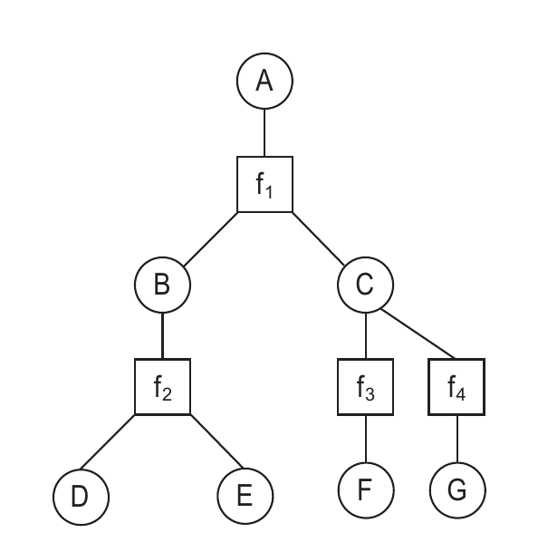

**图7-9 因子图的例子（原书图7-13 · 局部截图）**

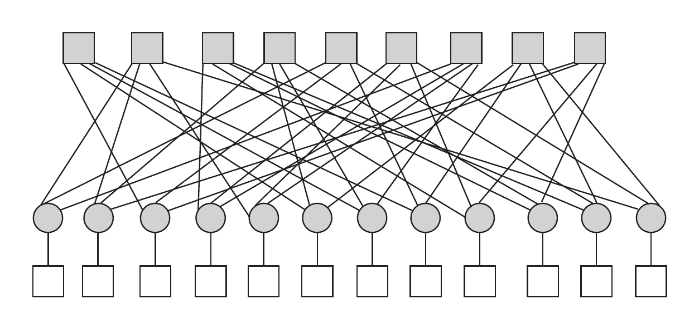

**图7-10 Tanner 图（原书图7-16 · 局部截图）**

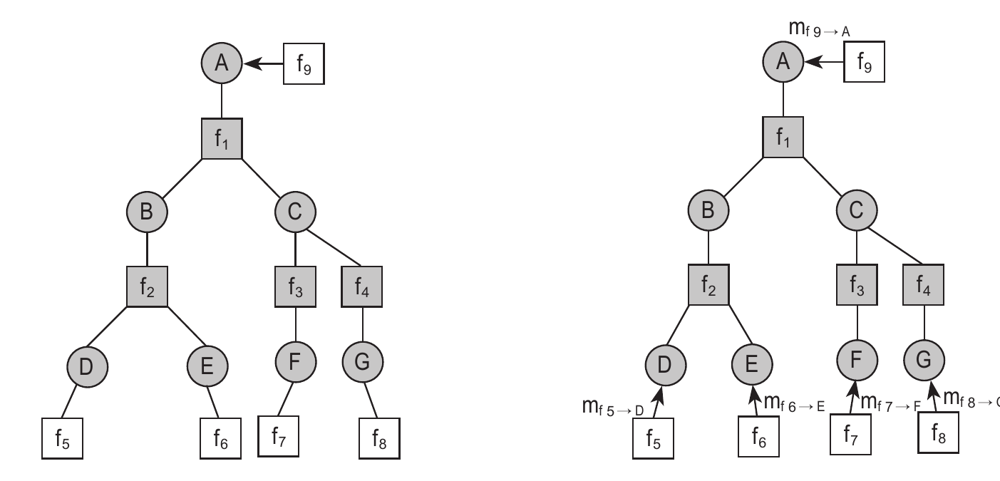

**图7-11 一个节点对应一棵树（原书图7-17 · 局部截图）**

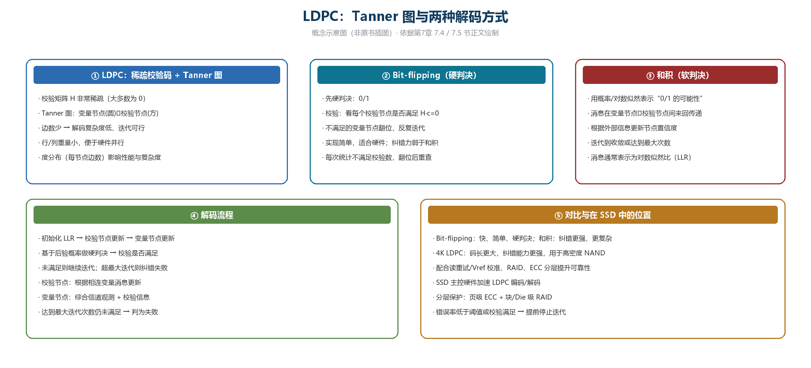

**图7-12 LDPC：Tanner 图与两种解码方式（概念示意图，非原书插图）**

---

## 小结

- **ECC 的作用**：在数据写入前加冗余，读出时纠错；冗余越多，纠错越强、成本越高；
- **模型**：BSC（翻转）与 BEC（删除）；编码距离决定可纠错误数；
- **LDPC**：稀疏校验矩阵 + Tanner 图，支持硬判决（Bit-flipping）与软判决（和积）；
- **在 SSD 中的位置**：主控硬件加速 LDPC，常配合读重试 / Vref 校准、RAID、端到端保护，把 RBER 压到可接受 UBER。
