# 第 8 章 PCIe 介绍 · 重点总结

> 依据《深入浅出SSD：固态存储核心技术、原理与实战（第 2 版）》第 8 章原文整理。插图均为从原书 PDF 裁切的局部图（非整页截图、不含原书图注）；标“概念示意图”者为辅助理解绘制的示意图，非书中原图。

---

## 0. 本章主线

第 8 章是“协议篇”的开篇。SSD 从 SATA 全面转向 PCIe，本章把 PCIe 从“**为什么更快 → 拓扑长什么样 → 三层怎么分 → 数据包（TLP）怎么来 → 怎么寻址/路由 → 各层职责 → 复位/省电/热插拔 → 性能开销 → 未来演进与虚拟化**”串起来。可以简记为：**PCIe 是串行、差分、点对点、树形、分层打包的协议**。

---

## 8.1 从 PCIe 的速度说起

- SSD 用 PCIe 的核心理由是**快**（且比 SATA 快得多）；带宽由“线速率 × Lane 数”决定，但要扣掉编码开销。
- **编码开销**：Gen1/2 用 8b/10b（8 位→10 位），约 20% 损耗；Gen3 起用 128/130，损耗约 2%，可忽略。所以“raw 速率”不等于“有效带宽”。
- **串行 vs 并行**：PCI 是并行总线，时钟频率受时钟偏移 / 信号偏斜（Clock Skew）限制；PCIe 改用**串行 + 差分信号**，没有“并行时钟同一时刻对齐”的问题，能跑更高频率。
- **全双工 vs 半双工**：PCIe 是**全双工**（每个设备独享一对接收 + 一对发送通道，可同时收发，类似“电话”）；SATA 是**半双工**（同一时刻只能发或收，类似“对讲机”）。

各代单 Lane 的双向带宽（×N 就是总带宽）：

| 代际 | 线速率 | 单 Lane 双向 | x16 双向 |
| --- | --- | --- | --- |
| PCIe 1.0 | 2.5 GT/s | 0.5 GB/s | 4 GB/s |
| PCIe 2.0 | 5.0 GT/s | 1.0 GB/s | 8 GB/s |
| PCIe 3.0 | 8.0 GT/s | 2.0 GB/s | 16 GB/s |
| PCIe 4.0 | 16 GT/s | 4.0 GB/s | 32 GB/s |
| PCIe 5.0 | 32 GT/s | 8.0 GB/s | 64 GB/s |

> 例：Intel SSD 750（PCIe 3.0 ×4，双向 4 GB/s，读 2200 MB/s、写 900 MB/s，430k/290k IOPS）。真实读写远低于理论带宽，因为还要受主控 / NAND 限制。

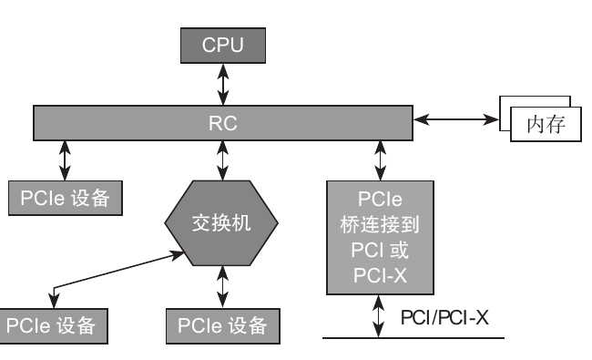

**图8-1 基于 PCIe 的计算机系统（原书图8-7 · 局部截图）**

---

## 8.2 PCIe 拓扑结构

- 网络拓扑有：总线型 / 环形 / 树形 / 星形 / 混合型 / 网状。
- **PCI = 总线型**：所有 PCI 设备挂在同一条系统总线上，共享带宽且要用“总线使用权”，谁传输要先获得总线使用权（图8-6）。
- **PCIe = 树形**：根是 **RC（Root Complex，根复合体）**，代表 CPU、是“树根 / 主干”；**EP（Endpoint，端点）** 如 SSD、网卡、显卡是“树叶 / 终端”；**交换机（Switch）** 是“树枝”，用来扩展端口。
- **RC 内部**：通过一根内部 PCI 总线（BUS 0）＋若干桥，扩展出多个 PCIe 端口（图8-8）。
- **交换机**：靠近 RC 的端口叫**上游端口（Upstream Port）**，向下扩展的多个叫**下游端口（Downstream Port）**；每个交换机只有一个上游端口。交换机内部也有一根内部 PCI 总线，经桥拉出端口（图8-10）。
- 端点可直接连 RC，也可连交换机；交换机为下挂设备提供**路由 / 转发**服务。

---

## 8.3 PCIe 分层结构

绝大多数总线/接口都用分层实现，PCIe 分**三层**：

- **事务层（Transaction Layer）**：创建/解析 **TLP**（Transaction Layer Packet），做流控、QoS、事务排队。
- **数据链路层（Data Link Layer）**：创建/解析 **DLLP**（Data Link Layer Packet），做链路层校验和纠错（ACK/NAK）、流控、电源管理。
- **物理层（Physical Layer）**：分**逻辑子模块**＋**电气子模块**，把包拆分到各 Lane、加扰、8b/10b（Gen3 后 128/130）编码、串并转换、差分收发。

分层的好处：各层职能相对独立，接口版本升级时往往只改某一层。

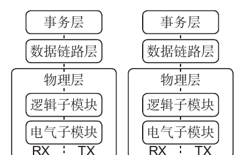

**图8-2 PCIe 分层结构（原书图8-11 · 局部截图）**

### 数据是“一层层穿衣 / 脱衣”的

- **发送（打包）**：事务层给 Data 加 Header（＋ECRC）→ 数据链路层在头上加**序列号（Sequence Number）**、在尾巴加 **LCRC** → 物理层在头加 **Start**、尾加 **End**（Gen3 无尾巴）。
- **接收（解包）**：物理层去头尾 → 数据链路层校验序列号 + LCRC，错则重传 → 事务层校验 ECRC（可选），错则丢弃、对则去 ECRC 得到数据。

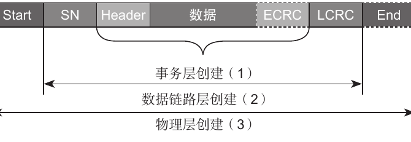

**图8-3 发送方打包 TLP 过程（原书图8-13 · 局部截图）**

---

## 8.4 PCIe TLP 类型

- 事务层按软件请求产生 **4 种 TLP**：**内存（Memory）**、**I/O**、**配置（Configuration）**、**消息（Message）**。
- **消息是 PCIe 新增**：PCI/PCI-X 用边带信号（Sideband，如中断、错误、电源管理）传递，PCIe 把这些改成“包内带内信号”传递。
- **Posted vs Non-Posted**：
  - **Posted（“写信”）**：发出后**不期待对方响应**，如**内存写（MWr）**、**消息（Message）**。
  - **Non-Posted（“打电话”）**：**必须要有响应**，如**内存读（MRd）**、配置读写、I/O 读写、响应 TLP。
- 记忆：**只有“内存写”和“消息”是 Posted，其余都是 Non-Posted**。

| 缩写 | 全称 | Posted |
| --- | --- | --- |
| MWr | Memory Write（内存写） | Posted |
| Message | 消息 | Posted |
| MRd | Memory Read（内存读） | Non-Posted |
| CfgRd0 / CfgRd1 | 配置读（Type0 / Type1） | Non-Posted |
| CfgWr0 / CfgWr1 | 配置写（Type0 / Type1） | Non-Posted |
| IO Read / IO Write | I/O 读写 | Non-Posted |
| CpID / Cpl | 带数据 / 不带数据的响应 | Non-Posted |

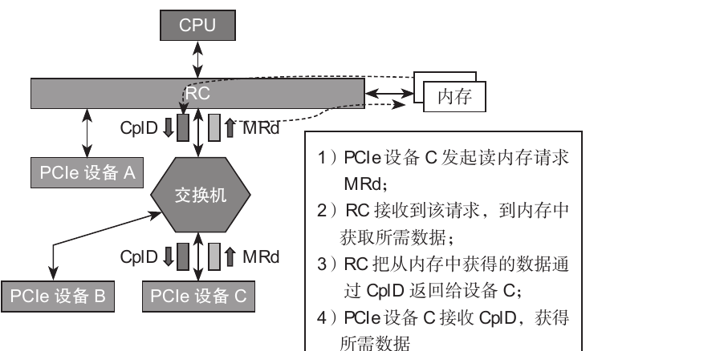

**图8-4 读内存示例（原书图8-17 · 局部截图）**

> 一个 TLP **最多带 4 KB** 有效数据：读 16 KB 需要发 4 个 MRd，RC 返回 4 个 **CpID（带数据的响应 TLP）**。

---

## 8.5 PCIe TLP 结构

TLP = **Header ＋ 数据（可选）＋ ECRC（可选，端到端 CRC）**。

- **Header 关键字段**（3 DW 或 4 DW）：
  - **Fmt + Type**：决定 TLP 类型、是否有数据、Header 是 3DW 还是 4DW。
  - **TC（Traffic Class）**：优先级 0～7，值越大优先越高。
  - **TH / TD / EP / AT / Attr**：提示处理、CRC 诊断（TD）、“有毒”数据、地址类型、属性。
  - **Length**：Payload 数据长度，10 位、单位 DW，最大 1024 DW = **4 KB**。
- **内存类 TLP 的地址**：地址域在 Header 里；系统内存 < 4 GB 用 32 位（3DW），≥ 4 GB 用 64 位（4DW），提高访问空间的灵活性。
- **配置类 Header**：由 **BDF（总线号 / 设备号 / 功能号）** 唯一定位；Type0 给终端、Type1 给交换机（桥）。
- **消息 Header**：总是 4DW，含 **Message Code**（如 Unlock、PM、ERR、Vendor 等）。
- **响应 Header**：含**响应者 ID**、**完成状态（Completion Status）**：SC / UR / CRS / CA。

---

## 8.6 PCIe 配置和地址空间

- 每个 PCIe 设备都有一段“配置文件”式空间——**配置空间**，是**协议约定好**的、绝对地址可预期的空间。
- **PCI = 256 B**，**PCIe = 4 KB**；为了向后兼容，前 256 B 布局不变（64 B Header ＋ 192 B Capability），多出的空间用于扩展（3 段总构成：Header + Capability + 扩展配置/存储空间）。
- 主机把设备配置空间**映射到内存地址空间**，CPU 通过 RC 间接访问（CPU 不能直接访问设备空间）。
- **BAR（Base Address Register，基址寄存器）**：Type0（终端）有 6 个 BAR，Type1（交换机）只有 2 个。BAR 描述该设备要暴露给主机的内部空间范围。
- **BAR 分配流程**：软件读 BAR → 往 BAR 写“全 1”读回固定位（判断是内存还是 I/O、32/64 位、是否可预取、对齐大小）→ 主机分配物理地址 → 回写 BAR。低 2～4 位是属性位（bit0=0 内存/1 I/O；bit2-3=地址位宽；bit3=可预取）。

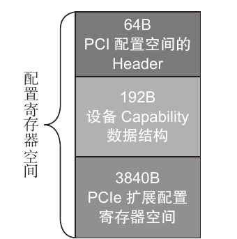

**图8-5 PCIe 设备的 4KB 配置空间（原书图8-28 · 局部截图）**

> 每个 PCIe 功能对应一个配置空间；一个设备可含多个功能（如硬盘功能、网卡功能）。

---

## 8.7 TLP 的路由

TLP 从源头到目的要“跨越千山万水”，本质是**交换机 / 端点根据 Header 里的地址或 ID 决定往下游发给谁**。共有 **3 种路由方式**：

- **基于地址（Memory Address）**：内存读/写 TLP。端点对比 Header 地址与自己端口的所有 **BAR**；交换机对比地址是否落在 **Memory Base / Limit** 之间（其下游设备的地址范围）。
- **基于设备 ID（BDF 序号）**：配置 TLP、响应 TLP（CpID）等。交换机对比 **Primary / Secondary / Subordinate Bus** 三个寄存器判断该 ID 属于哪个下游端口。
- **隐式（Implicit）**：**仅消息 TLP** 支持；看 **rr 位**（Type 域低 3 位）——**011 = RC 广播**、**100 = 终止于接收者**，无需知道目标地址/ID。

地址空间与 BDF：一个 PCIe 系统最多 256 条总线、每条总线最多 32 个设备、每个设备最多 8 个功能；功能是寻址基本单位，ID 由 BDF 唯一确定。

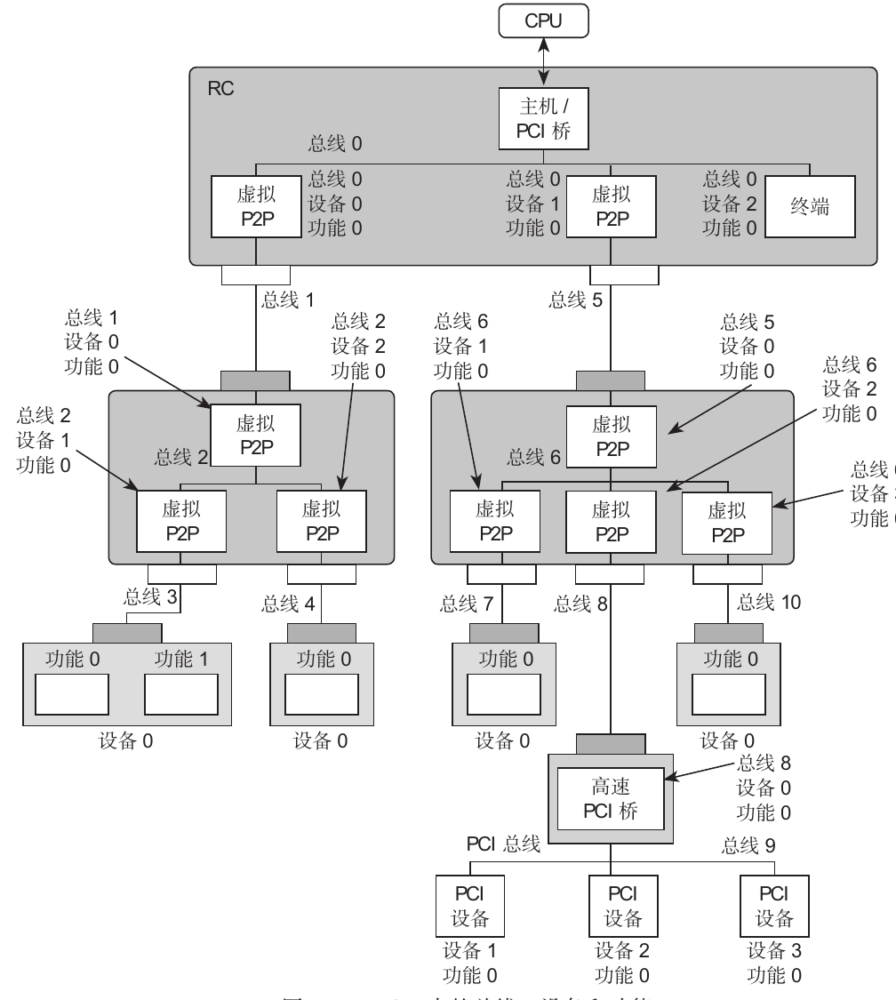

**图8-6 PCIe 中的总线、设备和功能（原书图8-36 · 局部截图）**

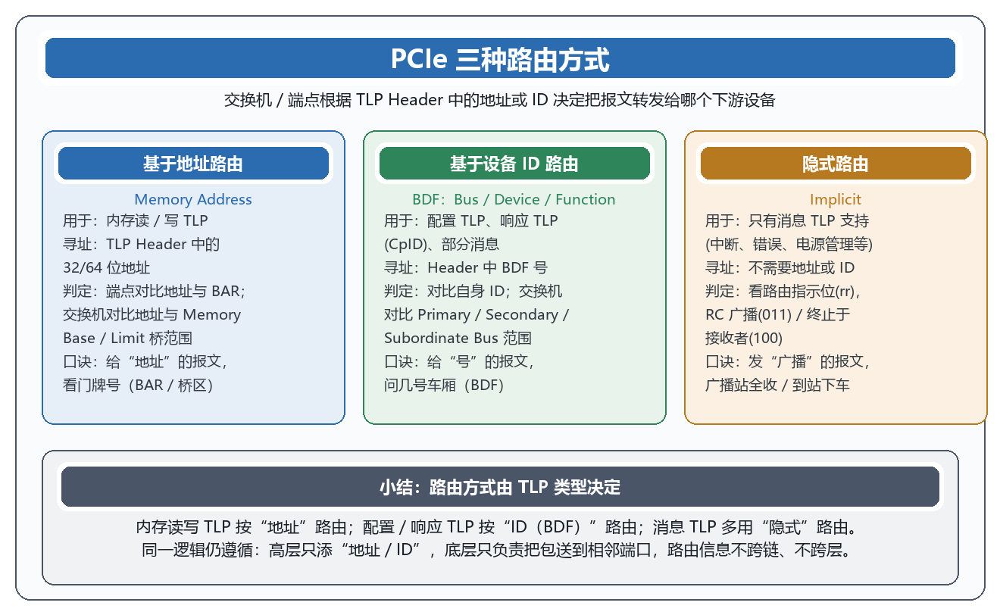

**图8-7 PCIe 三种路由方式（概念示意图，非原书插图）**

---

## 8.8 数据链路层

- 位于事务层之下、物理层之上，**保证 TLP 端到端正确传输**。
- **发送端**：给每个 TLP 加 **序列号 + LCRC**；**接收端**：校验 CRC 和序列号，错则拒绝并把该 TLP 交给上层前重传。
- **DLLP（数据链路层包）**：用于 ACK/NAK、流控、电源管理。**DLLP 只在与它相邻的两个端口间传**，不含路由信息（与 TLP 翻山越岭不同，DLLP 只在相邻端口之间）。
- **ACK/NAK 机制**：发送端把没被确认的 TLP 保留在 **Replay Buffer**；收到 ACK 说明正确并清除，收到 NAK 说明出错并**重传**。
- **流控（Flow Control）**：基于 **Credit**，防止接收缓存溢出。发送前先看对方有没有足够空间；接收方用 **UpdateFC** DLLP 预告可用空间。只对 TLP 流控，DLLP 本身不流控。
- **电源管理 DLLP**：如 PM_Enter_L1 等。

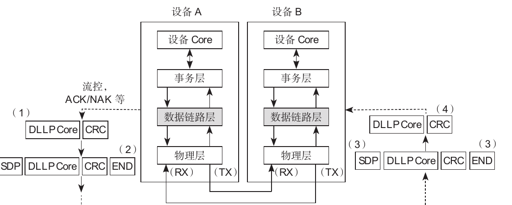

**图8-8 数据链路层在协议栈中的位置和作用（原书图8-49 · 局部截图）**

---

## 8.9 物理层

- 分**电气模块**＋**逻辑模块**。两大技术：**串行总线**＋**差分信号**。
- **差分信号**：两根线上的电平差（大 / 小）表示 0 / 1，抗共模干扰能力强；单端信号易受干扰（0.8V 变 1.5V 就把 0 当 1）。所以 PCIe 能跑更高的速率、带来更大带宽。
- **发送端逻辑**：Tx Buffer → 多路选择（Mux）→ **Byte Stripping**（把数据分配到各 Lane，类似串并转换）→ **加扰（Scramble）**（数据与随机数异或，均匀 0/1、减少 EMI）→ **8b/10b（Gen1/2）或 128/130（Gen3+）编码** → **并串转换** → 差分驱动（Tx）。
- **接收端逻辑**：逆向——差分接收 → 串并转换（恢复时钟）→ 8b/10b 解码（含错误检测）→ **解扰（De-scramble）** → **Byte Un-Stripping** → 去 Start/End → Rx Buffer → 交数据链路层。
- 8b/10b 把 1 字节变 10 位发送，是为了让 0/1 均匀并**嵌入时钟**（不需要单独的时钟线）；它的代价是 20% 带宽损耗。

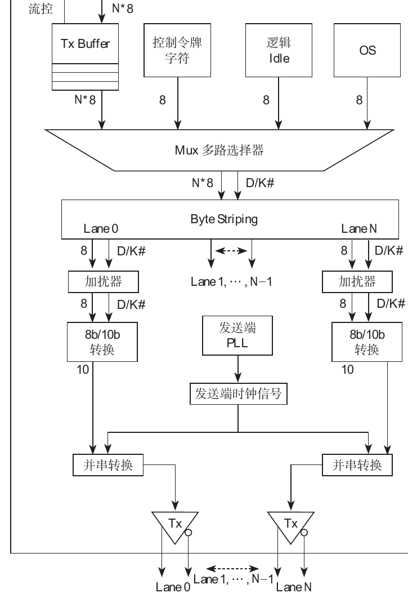

**图8-9 物理层发送端逻辑模块（原书图8-57 · 局部截图）**

---

## 8.10 PCIe 重置

重置术语很多，关键记“**从属关系**”：

- **Conventional Reset（常规重置）** = **Fundamental Reset（基础级）** ＋ **Function Level Reset（功能级，FLR）**。
- **Fundamental Reset（基础级）** 分两类：
  - **冷重置（Cold）**：整机掉/上电，Vcc 断开而 Vaux 仍在，硬件自检后复位。
  - **温重置（Warm，可选）**：保持 Vcc，由系统触发；PCIe 没有定义具体触发方式，把决定权交给系统。
- **Non-Fundamental Reset（非基础级）** = **Hot Reset（热重置）**：由软件通过 Bridge Control Register 的 bit6（Secondary Bus Reset）置位触发；RC 发“带热重置标志的 TS1”，约 2ms 后 **LTSSM：L0 → RCRVY → HOTRESET → DETECT**，再重新 **Link Training**。
- **FLR（功能级重置）**：只复位“某个功能”，不动整个设备；需要 Device Capabilities bit28 声明支持、Device Control bit15 触发；要在 **100ms 内完成**，且要先处理“未完成的 CplD / 事务挂起”，否则可能数据错乱。
- 另外还有 **PERST# 信号**、**TS1 Symbol 5 bit0（热重置）**、**Link Control 的 Link disable（bit）**，以及“Sticky / HwInit”类型寄存器（FLR 不清除它们）。

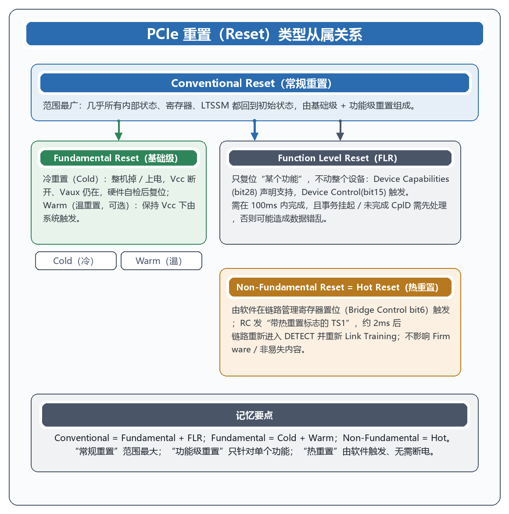

**图8-10 PCIe 重置类型从属关系（概念示意图，非原书插图）**

---

## 8.11 PCIe 最大有效载荷和最大读请求

- **MPS（Max Payload Size）**：单个 TLP 允许的最大数据长度，最高 **4 KB**；同一传输路径上所有设备必须用相同的 MPS，不能超过路径上任一设备。系统取各方能力的最小值。
- **MRQ（Max Read Request Size）**：每个读请求最多 **4 KB**（以 128 B 为单位）；系统 OS 在配置阶段设置，用于平衡吞吐量与带宽占用。
- 两者都放在 **Device Control Register**：MPS 在 bit[7:5]，MRQ 在 bit[14:12]。

---

## 8.12 PCIe SSD 热插拔

- 早期用 PCIe **闪存卡**插在服务器主板 PCIe 插槽：数量有限、供电受限、**散热差**、**不能热插拔**（坏了要停机拔卡）。
- **U.2（SFF-8639）PCIe SSD** 出现：外观/用法类似盘位式 SATA/SAS 硬盘，可通过服务器**前面板热插拔**；支持 U.2 后，服务器可塞进几十个盘位，密度提升、关键数据可放盘内、组成 RAID。
- 热插拔需要**硬件（避免电弧/自动检测）**、**背板**、**操作系统/驱动**配合；拨出流程：停止应用访问 → umount → 卸载驱动 → 拔出。

---

## 8.13 SSD PCIe 链路性能损耗分析

PCIe 链路上让“有效数据”低于理论值的开销：

1. **编码解码**：8b/10b 约 20% 损耗（Gen1/2）；128/130 几乎可忽略（Gen3+）。
2. **TLP 数据包开销**：每个包额外约 20～30 B（Start / 序列号 / Header / ECRC / LCRC / End）。
3. **传输开销**：**Skip（SKP）** 定时插入用于时钟偏差补偿，Gen1/2 每 1538 symbol 插一个 4B、Gen3 为 16B；SKP 不能在包中间插，只能在包与包之间。
4. **链路协议开销**：每发一个 TLP 都要回 **ACK**（可合并，不必 1:1），出错则 NAK 重传。
5. **流控**：UpdateFC 通知对方接收缓存，也占带宽。
6. **系统参数**：MPS、MRQ、**RCB（Read Completion Boundary）**——响应 CpID 常以 64B/128B（与内存地址对齐）为单位。

**量化例子**：200 个 MemWr、MPS=128、PCIe 1.0 ×8（每 4ns 传 8B）：Symbol time：2.5Gbps/8 → 4ns/字节；TLP 传输时间 =［(128+20)/8］× 4 = 74ns；DLLP = (8/8)×4 = 4ns；每 5 个 TLP 回 1 ACK（40 次）、每 4 个 TLP 发 1 FC Update（50 次）。
总数据 = 200 × 128 = 25600 B；传输时间 = 200×74 + 40×4 + 50×4 = 15160 ns → **约 1689 MB/s**。若把 MPS 调到 512B，则约 **1912 MB/s**。

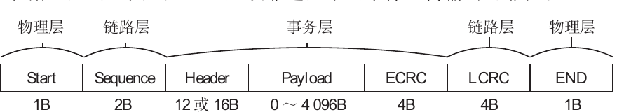

**图8-11 PCIe 2.0 TLP 格式（原书图8-68 · 局部截图）**

---

## 8.14 PCIe 省电模式 ASPM

- **ASPM = Active State Power Management**，**硬件自动触发**（无需软件介入）地把链路从 D0 低到更低功耗状态。
- **低功耗模式**：
  - **L0**：正常工作。
  - **L0s**：低功耗，恢复时间短。
  - **L1**：更低功耗，恢复时间较长。
  - **L2 / L2.L3 待备**：断电前的过渡；**L2** 辅助供电、极省电；**L3** 完全没电、功耗 0。
  - **L1.1 / L1.2**：比 L1 更省电的“ASPM Sub 状态”。
- **判断是否支持**：看 **Link Capabilities**（bit11:10）：00 保留、01 支持 L0s、10 保留、11 支持 L0s 和 L1。
- **是否开启**：看 **Link Control**（bit1:0）：00 禁用、01 L0s 使能、10 L1 使能。
- **L1 进入流程**（表8-9）：EP 确认收到 ACK、确认 FC Credit 足够、发送 PM_Active_State_Request_L1 给 RC → RC 确认（PM_Request_ACK）→ EP 发 Electrical Idle → 双方进入 L1。唤醒用 FTS 重新做 Link Training，或发 TS1、LTSM 重新建立连接。
- 链路状态转换：L0 → L0s / L1 / L1.1 / L1.2 → 恢复 → DETECT → 重新 Link Training。

---

## 8.15 PCIe 其他省电模式

- **L2**：所有时钟、电源全部关闭，最省电，但**退出时间最长**（毫秒级），多用于不允许的场景。
- **L1.1 / L1.2**：PCI-SIG 新增的 ASPM Sub 状态，比 L1 更省电、退出更快，需支持并打开 **CLKREQ#** 信号。
  - **L1.1**：Common Mode Voltage（共模电压）仍开，内部 PLL 等关闭。
  - **L1.2**：Common Mode Voltage 也关闭，最省电，但恢复稍慢。
- 功耗从 L1 的毫瓦级降到微瓦级（约 500µW / 10µW），时延在微秒级（<20µs / <70µs），完全在可接受范围。

---

## 8.16 PCIe 4.0 和 5.0 介绍

- **PCIe 4.0（2017）**：单通道 16 GT/s，是 3.0 的两倍；向后兼容。M.2 NVMe SSD ×4 带宽从 4 GB/s 提到约 8 GB/s。
- **PCIe 5.0（2019）**：32 GT/s，x16 带宽达 64 GB/s。
- **PCIe 6.0（2022）**：不再用 **NRZ**（Non-Return-to-Zero，两电平 0/1），改用 **PAM4**（4 电平脉冲幅度调制，4 个电平 00/01/10/11），**每符号传 2 bit**，带宽翻倍；但对信号质量要求大大提高（还需 25GB/s 以上场景 / 示波器、误码仪等配套仪器）。
- SSD 演进快的原因：NVMe SSD 顺序读早已触及 PCIe 3.0 ×4 上限，再往上只能靠提高通道数或更高速代际；同时要让 M.2 等接口与 CPU 计算能力匹配。

---

## 8.17 SR-IOV

**SR-IOV（Single Root I/O Virtualization，单根 I/O 虚拟化）**：把一个物理 PCIe 设备**虚拟出多个轻量 PCIe 设备**，分给不同虚拟机（VM），提升 I/O 虚拟化性能。

- **PF（Physical Function，物理功能）**：标准完整 PCIe 功能（有完整配置空间），由宿主机（Host）管理。
- **VF（Virtual Function，虚拟功能）**：轻量功能，不能单独初始化/配置资源，共享（受限于）PF 的资源；由客户机（Guest）驱动使用。
- 每个 VF 有独立 **RID**，配合 **IOMMU** 页表做 DMA 隔离；**IOVM（I/O Virtualization Manager）** 为每个 VF 分配虚拟配置空间；**VMM** 负责中断重映射（MSI 重定向）与数据交互。
- **好处**：提升性能（数据直接交互、中断重映射、资源共享）、管理简单（扩展性高、底层隔离、省插槽）、简化虚拟机设计（通用、宿主机负担轻）。
- **在 NVMe SSD 上**：可创建多个命名空间（Namespace）并与不同 VF 绑定，从而给不同虚拟机提供互相隔离的存储空间；云数据中心倾向支持 SR-IOV，如 AWS Nitro、微软等。

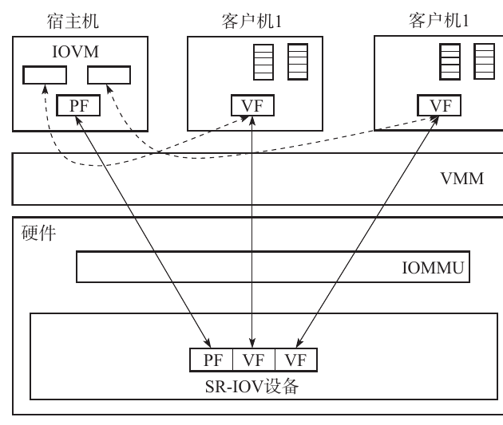

**图8-12 SR-IOV 工作原理（原书图8-76 · 局部截图）**

---

## 小结

- **本质**：PCIe 用“串行 + 差分 + 点对点”换来高带宽；用“树形拓扑 + 分层打包”实现可扩展与端到端可靠；用“地址 / ID / 隐式”三种路由让包正确到达目标。
- **三层**：事务层出 TLP、数据链路层加序号/LCRC 并做 ACK/NAK 与流控、物理层做拆分/加扰/编码/差分收发。
- **TLP**：4 类（内存 / I/O / 配置 / 消息），只有“内存写 + 消息”是 Posted，其余都要响应；单个 TLP 最多 4 KB。
- **配置与地址**：配置空间从 256B 扩到 4KB，靠 BAR 实现“设备内存 + 主机内存”的映射。
- **链路保障**：Reset（Cold/Warm/Hot）+ FLR；ASPM（L0s/L1/L1.1/L1.2）省电；U.2 支持热插拔。
- **性能**：编码、TLP 开销、Skip、ACK/NAK、流控、MPS/MRQ/RCB 共同决定实际吞吐；选大 MPS/MRQ、控制 ACK 频率可提效。
- **演进与虚拟化**：4.0/5.0 提速、6.0 用 PAM4；SR-IOV（PF/VF）把一块物理盘虚拟化给多个虚拟机。
